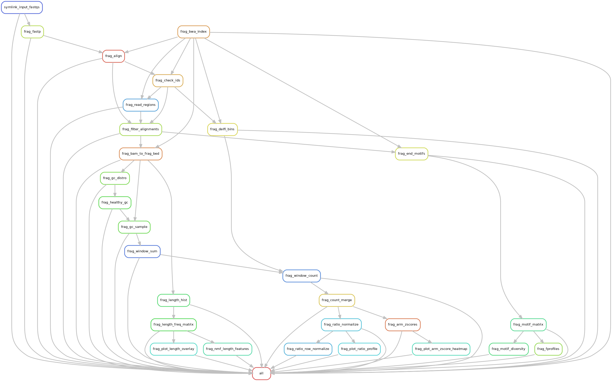

Fragmentomics pipeline for cell-free DNA whole-genome sequencing analysis. Extracts fragment length features, DELFI ratios, end-motif profiles, and NMF signatures from paired-end WGS data.  

[`frag.org`](frag.org) is the source of truth: the workflows, scripts, configs, tests and tools in this repository are tangled from it. The tangled files are committed complete, so the pipeline is runnable as committed without Emacs; edit `frag.org` and re-tangle rather than editing a tangled file.  

  

# Continuous Integration

# Key files

<table border="2" cellspacing="0" cellpadding="6" rules="groups" frame="hsides">

<colgroup>
<col  class="org-left" />

<col  class="org-left" />
</colgroup>
<thead>
<tr>
<th scope="col" class="org-left">Path</th>
<th scope="col" class="org-left">Holds</th>
</tr>
</thead>
<tbody>
<tr>
<td class="org-left"><a href="frag.org"><code>frag.org</code></a></td>
<td class="org-left">literate source; tangles every file below</td>
</tr>

<tr>
<td class="org-left"><a href="workflows/frag.smk"><code>workflows/frag.smk</code></a></td>
<td class="org-left">the module: rules only, reads no config; its preamble lists the variables a wrapper binds</td>
</tr>

<tr>
<td class="org-left"><a href="workflows/test.smk"><code>workflows/test.smk</code></a></td>
<td class="org-left">example wrapper and the CI target; binds every module variable</td>
</tr>

<tr>
<td class="org-left"><a href="Snakefile"><code>Snakefile</code></a></td>
<td class="org-left">entry point that includes the example wrapper, so <code>snakemake -n</code> works from the root</td>
</tr>

<tr>
<td class="org-left"><a href="config/common.yaml"><code>config/common.yaml</code></a></td>
<td class="org-left">configuration template for a project</td>
</tr>

<tr>
<td class="org-left"><a href="config/test.yaml"><code>config/test.yaml</code></a>, <a href="config/samples_test.tsv"><code>config/samples_test.tsv</code></a></td>
<td class="org-left">fixture configuration and sample sheet</td>
</tr>

<tr>
<td class="org-left"><a href="config/config.schema.yaml"><code>config/config.schema.yaml</code></a></td>
<td class="org-left">JSON schema of every config key; the wrapper checks the config against it and lists every problem</td>
</tr>

<tr>
<td class="org-left"><a href="envs/frag-conda-env.yaml"><code>envs/frag-conda-env.yaml</code></a></td>
<td class="org-left">the one pinned conda environment (Snakemake and every tool)</td>
</tr>

<tr>
<td class="org-left"><a href="scripts"><code>scripts/</code></a></td>
<td class="org-left">per-step R, Python and shell scripts called by the rules</td>
</tr>

<tr>
<td class="org-left"><a href="resources/data/delfi_bins_hg38.tsv"><code>resources/data/delfi_bins_hg38.tsv</code></a></td>
<td class="org-left">DELFI 5 Mb bins on hg38, built by <a href="tools/make_delfi_bins.py"><code>tools/make_delfi_bins.py</code></a></td>
</tr>

<tr>
<td class="org-left"><a href="tools"><code>tools/</code></a></td>
<td class="org-left">fixture fetch, pinned-output check, DELFI bin builder, end-motif summary, org update</td>
</tr>

<tr>
<td class="org-left"><a href="tests/unit"><code>tests/unit/</code></a></td>
<td class="org-left">known-answer and contract tests (pytest)</td>
</tr>

<tr>
<td class="org-left"><a href="tests/expected_outputs.md5"><code>tests/expected_outputs.md5</code></a>, <a href="tests/expected"><code>tests/expected/</code></a></td>
<td class="org-left">pinned fixture outputs</td>
</tr>

<tr>
<td class="org-left"><a href="resources/figures/frag.dag.png"><code>resources/figures/frag.dag.png</code></a></td>
<td class="org-left">rule graph</td>
</tr>

<tr>
<td class="org-left"><a href="LICENSE"><code>LICENSE</code></a>, <a href="CITATION.cff"><code>CITATION.cff</code></a></td>
<td class="org-left">MIT license; citation metadata</td>
</tr>
</tbody>
</table>

# Including from your wrapper

[`workflows/frag.smk`](workflows/frag.smk) contains rules only and reads no config. Every path and parameter is a Python variable the including wrapper defines before its `include:` line; the list, one line per variable, is the comment at the top of `workflows/frag.smk`. [`workflows/test.smk`](workflows/test.smk) is the complete example: copy it, keep its variable block, and replace `rule all` with the outputs your project needs.  

# Configuration

A run takes one YAML config passed with `--configfile`. [`config/common.yaml`](config/common.yaml) is the template for a new project (every key, with placeholder paths); [`config/test.yaml`](config/test.yaml) configures the committed chr22 fixture. [`config/config.schema.yaml`](config/config.schema.yaml) declares every key the wrappers read, and the wrapper validates the loaded config against it before building the DAG, printing every violation and every undeclared key together. The sample sheet ([`sample-tsv-path`](config/config.schema.yaml)) is a TSV with columns `r1_basename`, `r2_basename` (relative to [`directories.inputs`](config/config.schema.yaml)), `library_id` and `cohort`; [`config/samples.tsv`](config/samples.tsv) is the template and [`config/samples_test.tsv`](config/samples_test.tsv) the fixture sheet. [`repo-dir`](config/config.schema.yaml) is the frag repository root the rules run scripts from, [`available-concurrency`](config/config.schema.yaml) the concurrency budget, and [`frag_ref_assemblies`](config/config.schema.yaml) holds exactly one reference. [`delfi_bins`](config/config.schema.yaml) is the DELFI 5 Mb bin table ([`resources/data/delfi_bins_hg38.tsv`](resources/data/delfi_bins_hg38.tsv) for hg38) and `blklist` the blacklist removed from the read regions.  

Reads are kept on chr1 to chr22 outside blacklisted bases, with MAPQ ≥ 30, and without duplicates (marked at alignment), secondary or supplementary alignments. End motifs are the 4 reference bases at the 5′ end of every paired, primary, mapped, non-duplicate read with MAPQ ≥ 30, strand-aware (see [End motifs](frag.org#end-motifs) in [`frag.org`](frag.org)). [`end_motif.max_ends`](config/config.schema.yaml) caps the ends counted per library by read-name-hash subsampling, which keeps mates together and samples the whole genome; `null` (the default) counts every end. [`end_motif.seed`](config/config.schema.yaml) sets the subsample seed.  

The conda environment is [`envs/frag-conda-env.yaml`](envs/frag-conda-env.yaml) (every package pinned, Snakemake included). Run Snakemake from inside it, or from any Snakemake with `--use-conda`.  

# Testing

-   Fixture run: [`tests/full/inputs/`](tests/full/inputs) holds a chr22 reference subset and 60,000 read pairs from each of four PRJNA326698 cfDNA WGS libraries (the wrapper uses lib001 and lib002), rebuilt by [`tools/get_test_data.sh`](tools/get_test_data.sh). From the repository root, `snakemake --cores 4` runs it inside an environment built from [`envs/frag-conda-env.yaml`](envs/frag-conda-env.yaml) (or add `--use-conda`; the root [`Snakefile`](Snakefile) includes [`workflows/test.smk`](workflows/test.smk)); add `--dry-run` to plan only.
-   Pinned outputs: `tools/check_expected_outputs.sh tests/full` compares 28 byte-stable fixture outputs to the md5 pins in [`tests/expected_outputs.md5`](tests/expected_outputs.md5) and 5 floating-point tables numerically (relative tolerance 1e-6) to copies in [`tests/expected/`](tests/expected).
-   Unit tests: `python -m pytest -q tests/unit` (known-answer tests of the end-motif extractor, the motif matrix, the read regions and the DELFI bins, and a test of the module's wrapper contract). Tests that need samtools or bedtools skip when they are not on PATH; `FRAG_REQUIRE_TOOLS=1` makes that an error.
-   Continuous integration (GitHub Actions, on push to master and on pull requests): smk-dry (DAG dry run and unit tests), smk-run (full fixture run and pinned-output check), test-data (fixture rebuild).

# Directory structure

    frag/
    ├── frag.org                literate source; tangles everything below
    ├── README.md               exported from the README section
    ├── LICENSE, CITATION.cff   MIT; citation metadata
    ├── Snakefile               entry point: includes workflows/test.smk
    ├── config/                 common.yaml (template), test.yaml, samples.tsv (template), samples_test.tsv, config.schema.yaml, cfdna-test.yaml (kh_01 validation)
    ├── envs/                   the one conda environment YAML
    ├── workflows/              frag.smk (module), test.smk (example wrapper), cfdna-test.smk (kh_01 validation)
    ├── scripts/                per-step scripts called by the rules
    ├── tools/                  fixture fetch, pinned-output check, DELFI bin builder, end-motif summary, org update
    ├── resources/
    │   ├── data/               DELFI bins, blacklists, Mathios 2021 bin table
    │   └── figures/            rule graph
    └── tests/
        ├── unit/               pytest tests of scripts/ and of the module contract
        ├── expected/           expected copies of the floating-point fixture outputs
        └── full/inputs/        committed fixtures; the rest of tests/full/ is the run's output, git-ignored

# Change log

-   Development since last tag  
    -   [2026-09-24 Thu]  Read regions, duplicates and bins (round 2 of v2). Every motif, motif-diversity, F-profile, fragment-length, ratio and arm z-score output changes. The filtered BAM keeps reads on chr1 to chr22 outside blacklisted bases (new rule [`frag_read_regions`](workflows/frag.smk), `bedtools subtract` of the blacklist, restoring the 2022 logic) instead of reads inside whole blacklist-free GC-filtered 5 Mb windows, which kept 1,573 Mb on kh\_01 and no chrX; it also drops unmapped, secondary, duplicate and supplementary reads (`samtools view -q 30 -F 3332`). The alignment step marks duplicates (`samtools fixmate -m`, sort, `samtools markdup`). Fragment counts use DELFI 5 Mb bins rebuilt on hg38 by the Mathios 2021 rule (GC ≥ 0.3, Umap k100 mappability ≥ 0.9; 487 bins, 2.435 Gb; [`resources/data/delfi_bins_hg38.tsv`](resources/data/delfi_bins_hg38.tsv), built by [`tools/make_delfi_bins.py`](tools/make_delfi_bins.py)); config key [`delfi_bins`](config/config.schema.yaml) replaces `gc5mb`. On kh\_01 (Validation) 11.9 % of primary reads are duplicates, the read regions keep 2.69 Gb of the 2.88 Gb of autosomes, 290,002,628 ends are counted (CC-end share 0.159, r = 0.9996 against round 1), and all 487 bins hold fragments. Verified: fixture run completes; kh\_01 rerun exits 0.
    -   [2026-09-24 Thu]  Module contract and structure. Wrappers bind `R_FRAG` from the new key [`repo-dir`](config/config.schema.yaml) and rules run `R_FRAG/scripts/...`, so the module works when included from another directory; every rule declares a concurrency cost and the new key [`available-concurrency`](config/config.schema.yaml) sets the budget; the schema allows one reference and requires at least one healthy library, which must be among the selected libraries. The root [`Snakefile`](Snakefile) sets the fixture as its default target. Fixture pins hold across BLAS kernels (5 floating-point tables compared numerically) and fail when the pin file is truncated. New unit tests cover the read regions, the DELFI bins, the module contract and the subsampling, MAPQ, soft-clip and soft-mask cases of the end-motif extractor; `FRAG_REQUIRE_TOOLS=1` (set in CI) makes a missing tool an error. CI runs the fixture inside the env it builds, on node24 action versions. [`frag.org`](frag.org) follows the biopipe notebook skeleton (README, Repository setup with test-data tool, GitHub tests, LICENSE and CITATION blocks, processing Overview, Reference preparation, Reference, one Ideas). Snakemake is pinned to 9.21.0. Verified: unit tests pass; fixture run completes; pins ok.
    -   [2026-09-24 Thu]  End motifs are counted strand-aware from the reference at the 5′ end of every paired, primary, mapped, non-duplicate read with MAPQ ≥ 30 (`samtools view -q 30 -f 1 -F 3340`, both mates). The previous extraction keyed the end on read number (read 1's leftmost 4 bases, read 2's rightmost 4 bases reverse-complemented), so for every pair whose read 1 maps to the minus strand it returned the read's 3′ end, interior to the fragment whenever the fragment is longer than the read (about 40 % of motifs in Axel Hidalgo's measurement on one EM-seq library); its subsample was truncated in coordinate order, and it used MAPQ 60 and kept duplicates. [`scripts/frag_end_motifs.sh`](scripts/frag_end_motifs.sh) and [`scripts/frag_motif_matrix.py`](scripts/frag_motif_matrix.py) are adapted from the extractor by Axel Hidalgo, commit 7a5767ab1 (2026-09-18); rule `frag_sample_motifs` is now [`frag_end_motifs`](workflows/frag.smk), per-library outputs are `motifs/{library_id}.{ref_name}.motif_counts.tsv` (256 motifs plus `OTHER`), and a motif x library count matrix is written beside `all_motifs.tsv`. Config [`end_motif.max_ends`](config/config.schema.yaml) (null counts every end) and [`end_motif.seed`](config/config.schema.yaml) replace `n_motif` and `n_reads`. This changes every motif, motif-diversity and F-profile output, and changes the module interface, so v2.0.0 is the intended next tag. On the chr22 fixture lib001 counts 3,068 ends (CC-end share 0.121) and lib002 2,979 (0.105). On the full-genome healthy library kh\_01 (Validation) every one of 192,998,342 qualifying reads is counted, CCCA, CCTG and CCAG lead the table (the old extraction had AAAA second), the CC-end share is 0.157 against 0.112 for the old extraction, and a 10 M `max_ends` subsample reproduces the all-ends fractions (r = 0.99998) with every chromosome sampled in proportion, where the old extraction sampled only chr1 to chr11. Verified: 10 known-answer unit tests pass; fixture run completes; kh\_01 runs exit 0.
    -   [2026-09-24 Thu]  Repository brought to the current biopipe standard. The conda env moves to [`envs/frag-conda-env.yaml`](envs/frag-conda-env.yaml) with every package pinned (snakemake 9.14.5, samtools 1.24, bedtools 2.31.1, plus jsonschema and pytest). [`workflows/frag.smk`](workflows/frag.smk) reads no config: the wrappers bind every value as a variable, listed in the module preamble. [`config/config.schema.yaml`](config/config.schema.yaml) and `check_config()` validate the config at startup. [`config/common.yaml`](config/common.yaml) and [`config/samples.tsv`](config/samples.tsv) are templates; the fixture sheet is [`config/samples_test.tsv`](config/samples_test.tsv); a one-line root `Snakefile` includes the test wrapper; fixture logs and benchmarks go under [`tests/full/`](tests/full). Reference data files move to [`resources/data/`](resources/data), the DAG to [`resources/figures/frag.dag.png`](resources/figures/frag.dag.png); tracked [`docs/`](docs) files are untracked; [`LICENSE`](LICENSE) (MIT) and [`CITATION.cff`](CITATION.cff) are added; `config/int_test.yaml` (read by nothing) and the copied reference implementation folder are removed. The full-genome kh\_01 wrapper and config get org blocks under Validation, which also records the kh\_01 end-motif comparison. 32 deterministic fixture outputs are pinned in [`tests/expected_outputs.md5`](tests/expected_outputs.md5) and checked by [`tools/check_expected_outputs.sh`](tools/check_expected_outputs.sh). CI triggers on push to master and pull requests, and runs the unit tests and the pin check. This change log replaces `CHANGELOG.md`. Verified: unit tests pass; fixture run completes; every pin ok on a clean run.
-   [2026-06-11 Thu]  v1.0.0. First tagged release: a biopipe-standard-conformant cfDNA fragmentomics pipeline.  
    -   Restructured to the biopipe module pattern; migrated the fragment-length (GC normalization chain) and end-motif pipelines from the archived `cfdna` repo into `workflows/frag.smk`.
    -   Migrated feature extraction from `nf1_fragmentomics`: fragment-length histograms, DELFI arm z-scores, ratio row-normalization, and QC plots (all R).
    -   Migrated from `candetect/delfi`: NMF fragment-length features, F-profiles (NMF + NNLS on motifs), motif-diversity score (Shannon entropy).
    -   Added GitHub Actions CI (test-data, smk-dry, smk-run) and the [`frag_check_ids`](workflows/frag.smk) identifier-compatibility gate.
    -   Brought the repo structure in line with the biopipe standard: CLAUDE.md / AGENTS.md / CHANGELOG.md, test sample sheet at `config/samples.tsv`, DAG figure at [`docs/frag.dag.png`](docs/frag.dag.png); removed legacy `test/`, the org LaTeX-preview cache, the `frag.md` stub, the orphaned `count_scale.R`, and the tangle preamble headers.
    -   Added the `frag_checks.{R,py}` data-integrity library and conformed all 13 R analysis scripts plus the 2 Python scripts to the code style guide, guarding read inputs.
    -   Seeded `sample_frags_by_gc` (`set.seed(42)`) for reproducibility; made `figure_schema.R` optional for CI with relative test-config paths.
    -   Full-genome validation: 6-sample run (3 healthy, 3 cancer) on ncbi\_hg38; all steps pass.
    -   Added the test data set (WGS cfDNA, PRJNA326698, chr22).

# Working in this repo

-   The tangled files under [`workflows/`](workflows), [`scripts/`](scripts), [`config/`](config), [`envs/`](envs), [`tools/`](tools), [`tests/`](tests) and `.github/` are complete and runnable as committed: clone, create the environment from [`envs/frag-conda-env.yaml`](envs/frag-conda-env.yaml), and run `snakemake -n` from the repository root to plan the fixture run. Emacs is not needed to run or to read the pipeline.
-   [`frag.org`](frag.org) is the source of truth. Code changes are made there and tangled out; a change made directly to a tangled file is overwritten by the next tangle, so a contributor without Emacs sends the change as a patch naming the file, and the maintainer applies it in the org.
-   [`tools/shell/org_update.sh`](tools/shell/org_update.sh) tangles, exports README.md and runs the git workflow; it depends on the maintainer's Emacs setup.
-   `python -m pytest -q tests/unit` runs the unit tests; `FRAG_REQUIRE_TOOLS=1` makes a missing samtools or bedtools an error instead of a skip.
-   `tools/check_expected_outputs.sh tests/full` compares a fixture run with the pinned outputs; `--write` regenerates them after an intended output change.

