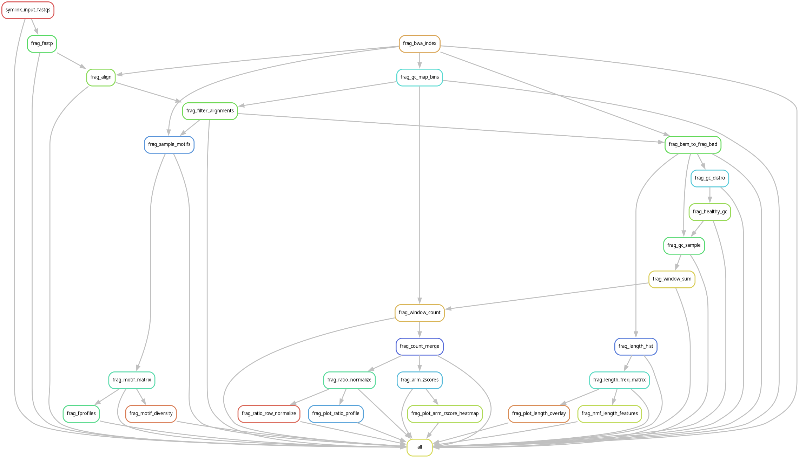

Fragmentomics pipeline for cfDNA whole-genome sequencing analysis. Extracts fragment length features, DELFI ratios, end motif profiles, and NMF signatures from paired-end WGS data.

# Continuous Integration

# Change Log

- Development since last tag
    - Add GitHub Actions CI (test-data, smk-dry, smk-run)
    - QC plots: consistent theme_scifig styling, Helvetica font fallback, chromosome labels on ratio profile, squished z-score heatmap scale
    - Remove tangle preamble inserter (timestamp in conda yaml broke snakemake env hashing)
    - Full-genome validation: 6-sample run (3 healthy, 3 cancer) on ncbi_hg38 — all steps pass
    - README with pipeline DAG and CI status badges
