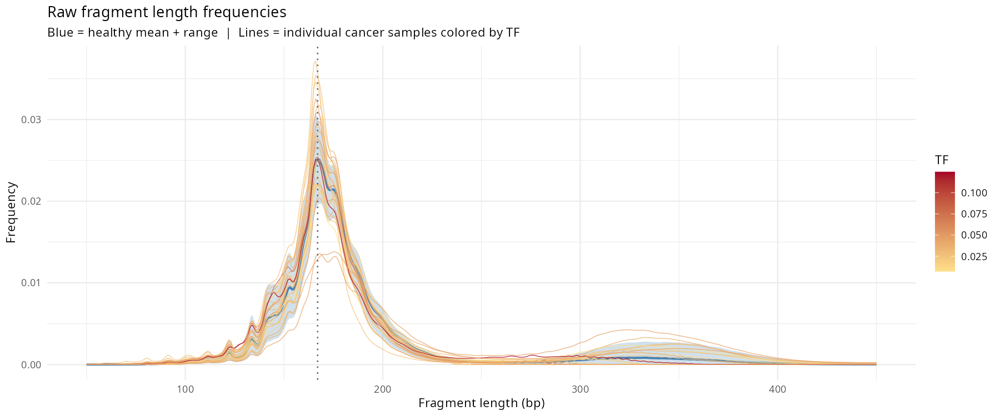
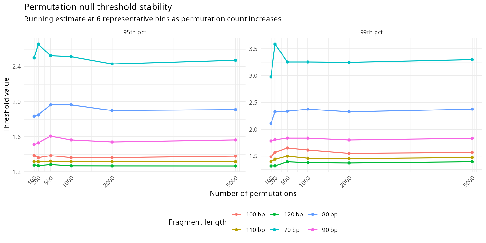
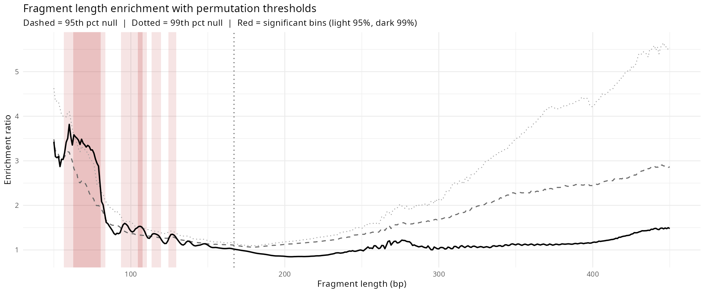
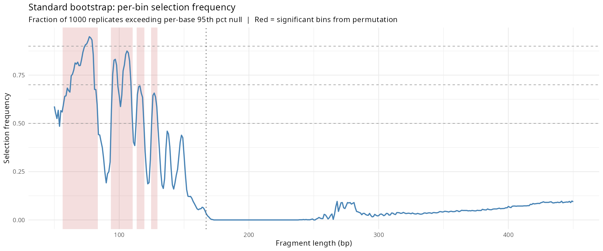
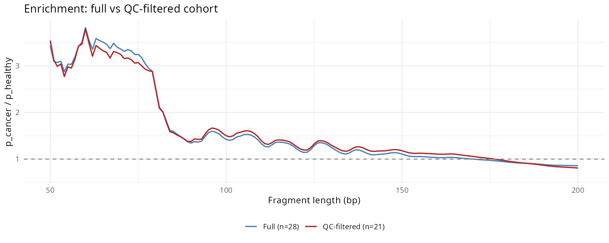
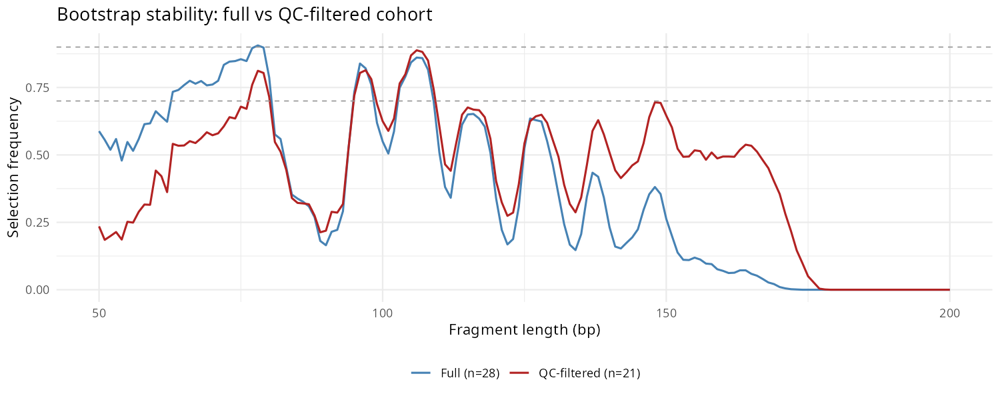

* Cell-free DNA Fragmentomics Analysis                              :biopipe:
- [ ] ingest https://github.com.mcas.ms/epifluidlab/FinaleToolkit
- [ ] could probably go a little heavier on data size to test
** [[id:339b69f6-6c09-4e9d-a2ec-27bdf5747163][README]]
** Repository setup and administration
*** Org update
- save emacs buffer
- update readme
- tangle repo
- git update

#+begin_src bash :tangle ./tools/shell/org_update.sh
#!/usr/bin/env bash
set -euo pipefail

# -----------------------------------------------------------------------------
# org_update.sh
#
# Orchestrate a small repo maintenance workflow:
#   1) Save open Emacs buffers via emacsclient (if a server is available)
#   2) Tangle selected repo Org files
#   3) Export a README.md from a specific Org node (via a Python helper)
#   4) Save buffers again (best-effort)
#   5) Run a git update workflow in each repo (via basecamp_functions.sh)
#
# Diagnostics are written to stderr. Stdout is reserved for primary outputs.
# -----------------------------------------------------------------------------

# =============================================================================
# SECTION: CONFIGURATION
# =============================================================================

BASECAMP_LIB="${BASECAMP_LIB:-${HOME}/repos/basecamp/lib/basecamp_functions.sh}"

REPOS=(
  frag
)

REPO_DIR="${HOME}/repos/frag"
README_ORG="${REPO_DIR}/frag.org"
README_NODE="339b69f6-6c09-4e9d-a2ec-27bdf5747163"
README_EXPORT="${HOME}/repos/emacs/scripts/emacs_export_header_to_markdown.py"

# =============================================================================
# SECTION: USAGE AND INPUT PARSING
# =============================================================================

print_usage() {
  cat <<EOF
Usage: ${0##*/} [OPTIONS]

Run a repo maintenance workflow: save Emacs buffers, tangle Org files, export
README.md, and run a git update workflow.

Options:
  -h, --help  Show this help message and exit

Examples:
  ${0##*/}

EOF
}

parse_args() {
  if [[ $# -gt 0 ]]; then
    case "${1:-}" in
      -h|--help)
        print_usage
        exit 0
        ;;
      ,*)
        echo "Error: Unrecognized argument: ${1:-}" >&2
        echo >&2
        print_usage >&2
        exit 2
        ;;
    esac
  fi

  if [[ ! -r "$BASECAMP_LIB" ]]; then
    echo "Error: BASECAMP_LIB not readable: $BASECAMP_LIB" >&2
    exit 1
  fi

  if [[ ! -d "$REPO_DIR" ]]; then
    echo "Error: REPO_DIR not found: $REPO_DIR" >&2
    exit 1
  fi

  if [[ ! -f "$README_ORG" ]]; then
    echo "Error: README_ORG not found: $README_ORG" >&2
    exit 1
  fi

  if [[ ! -f "$README_EXPORT" ]]; then
    echo "Error: README_EXPORT script not found: $README_EXPORT" >&2
    exit 1
  fi
}

################
###   Main   ###
################

main() {
  parse_args "$@"

  source "$BASECAMP_LIB"

  save_in_emacs

  for repo in "${REPOS[@]}"; do
    tangle_repo_org "$repo" || true
  done

  update_readme
  save_in_emacs

  for repo in "${REPOS[@]}"; do
    git_update_repo "$repo" || true
  done
}

# =============================================================================
# SECTION: WORK FUNCTIONS
# =============================================================================

emacs_server_available() {
  command -v emacsclient >/dev/null 2>&1 && emacsclient -e "(progn t)" >/dev/null 2>&1
}

save_in_emacs() {
  if emacs_server_available; then
    emacsclient -e "(save-some-buffers t)" >/dev/null
    echo "[INFO] Saved buffers via emacsclient" >&2
  else
    echo "[INFO] No Emacs server; skipping save" >&2
  fi
}

update_readme() {
  echo "[INFO] Exporting README.md from: $README_ORG" >&2

  pushd "$REPO_DIR" >/dev/null
  python3 "$README_EXPORT" --org_file "$README_ORG" --node_id "$README_NODE"
  popd >/dev/null
}

tangle_repo_org() {
  local repo="$1"
  local org_file="${HOME}/repos/${repo}/${repo}.org"

  echo "[INFO] Repo: $repo" >&2

  if [[ -f "$org_file" ]]; then
    echo "[INFO] Tangling: $org_file" >&2
    tangle "$org_file"
  else
    echo "[WARN] Missing Org file; skipping: $org_file" >&2
  fi
}

git_update_repo() {
  local repo="$1"
  local repo_dir="${HOME}/repos/${repo}"
  local output=""

  echo "[INFO] Updating git workflow: $repo" >&2

  if [[ ! -d "$repo_dir" ]]; then
    echo "[WARN] Repo directory missing; skipping: $repo_dir" >&2
    return 0
  fi

  pushd "$repo_dir" >/dev/null

  if ! output="$(git_wkflow_up 2>&1)"; then
    echo "[ERROR] git_wkflow_up failed in: $repo" >&2
    echo "$output" >&2
    popd >/dev/null
    return 1
  fi

  printf '%s\n%s\n' "$(date)" "$output" >&2
  popd >/dev/null
}

# =============================================================================
# SECTION: ENTRY POINT
# =============================================================================

main "$@"
#+end_src

*** README
:PROPERTIES:
:ID:       339b69f6-6c09-4e9d-a2ec-27bdf5747163
:END:
**** Change Log
- Development since last tag
  - [2026-03-13 Thu] Migrated from candetect/delfi: NMF fragment length features (sklearn), F-profiles (NMF+NNLS on motifs), motif diversity score (Shannon entropy). Added scikit-learn+scipy to conda env. Switched frag_length_hist.R to data.table for efficiency. Pipeline now 25 rules, 36 test steps.
  - [2026-03-13 Thu] Migrated feature extraction from nf1_fragmentomics: 7 new rules (fragment length histograms, DELFI arm z-scores, ratio row-normalization, 3 QC plots). All R, no Picard dependency. Pipeline now 22 rules, 33 test steps pass.
  - [2026-03-13 Thu] Restored `** Fragment Length Window Optimization` (dropped by restructure moonshot). Added `*** ichorCNA Validation` with initial results, coverage-enrichment tradeoff, SNR breakeven model, and next steps. Updated career.org project heading with 4-phase plan.
  - [2026-03-12 Thu] Fixed pipeline: gc_map_bins (windowing+GC), count_merge (filename parsing), conda env (removed name:), documented test data provenance (WGS cfDNA, PRJNA326698)
  - [2026-03-12 Wed] Restructured to biopipe module pattern; migrated fragment length (GC normalization chain) and end motif pipelines from [[https://github.com/jeszyman/cfdna][cfdna]] (now archived) into =workflows/frag.smk= (16 =frag_=-prefixed rules)
  - [2025-12-17 Wed] Added test data set

** Conda environments
*** Frag
:PROPERTIES:
:header-args:yaml: :tangle ./config/frag-conda-env.yaml :comments no
:END:

#+begin_src yaml
channels:
  - conda-forge
  - bioconda

dependencies:
  - bedtools
  - bwa
  - fastp
  - fastqc
  - r-data.table
  - r-tidyverse
  - samtools
  - scikit-learn
  - scipy
  - snakemake
  - sra-tools
#+end_src

** Fragmentomics sequence processing
:PROPERTIES:
:header-args:snakemake: :tangle ./workflows/frag.smk
:END:

*** Preamble
#+begin_src snakemake
#########1#########2#########3#########4#########5#########6#########7#########8
#
# This is a modular snakefile, intended to be incorporated into a larger
# workflow using the "include:" directive. (See
# https://snakemake.readthedocs.io/en/stable/snakefiles/modularization.html)
#
#########1#########2#########3#########4#########5#########6#########7#########8
#+end_src

*** Read processing
**** FASTQ processing
#+begin_src snakemake
rule frag_fastp:
    message:
        "Fragmentomics fastp FASTQ processing"
    conda:
        CONDA_FRAG
    input:
        r1 = f"{D_FRAG}/fastqs/{{library_id}}.raw_R1.fastq.gz",
        r2 = f"{D_FRAG}/fastqs/{{library_id}}.raw_R2.fastq.gz",
    log:
        cmd = f"{D_LOGS}/{{library_id}}_frag_fastp.log",
    benchmark:
        f"{D_BENCHMARK}/{{library_id}}_frag_fastp.tsv"
    params:
        extra = config.get("fastp", {}).get("extra", ""),
    threads:
        8
    output:
        failed = f"{D_FRAG}/fastqs/{{library_id}}.failed.fastq.gz",
        html = f"{D_FRAG}/qc/{{library_id}}_frag_fastp.html",
        json = f"{D_FRAG}/qc/{{library_id}}_frag_fastp.json",
        r1 = f"{D_FRAG}/fastqs/{{library_id}}.processed_R1.fastq.gz",
        r2 = f"{D_FRAG}/fastqs/{{library_id}}.processed_R2.fastq.gz",
    shell:
        """
        exec &>> "{log.cmd}"
        echo "[fastp] $(date) lib={wildcards.library_id} threads={threads}"

        fastp \
          --detect_adapter_for_pe \
          --disable_quality_filtering \
          --in1 "{input.r1}" --in2 "{input.r2}" \
          --out1 "{output.r1}" --out2 "{output.r2}" \
          --failed_out "{output.failed}" \
          --json "{output.json}" --html "{output.html}" \
          --thread {threads} \
          {params.extra}
        """
#+end_src

**** BWA index
#+begin_src snakemake
rule frag_bwa_index:
    message:
        "Index reference FASTA for BWA alignment"
    conda:
        CONDA_FRAG
    input:
        lambda wc: f"{D_INPUTS}/{config['frag_ref_assemblies'][wc.ref_name]['input']}"
    log:
        cmd = f"{D_LOGS}/{{ref_name}}_bwa_index.log",
    benchmark:
        f"{D_BENCHMARK}/{{ref_name}}_bwa_index.tsv"
    params:
        out_dir = lambda wc: f"{D_FRAG}/ref/bwa/{wc.ref_name}",
        fasta_target = lambda wc: f"{D_FRAG}/ref/bwa/{wc.ref_name}/{wc.ref_name}.fa",
    threads:
        50
    output:
        fa  = f"{D_FRAG}/ref/bwa/{{ref_name}}/{{ref_name}}.fa",
        fai = f"{D_FRAG}/ref/bwa/{{ref_name}}/{{ref_name}}.fa.fai",
        amb = f"{D_FRAG}/ref/bwa/{{ref_name}}/{{ref_name}}.fa.amb",
        ann = f"{D_FRAG}/ref/bwa/{{ref_name}}/{{ref_name}}.fa.ann",
        bwt = f"{D_FRAG}/ref/bwa/{{ref_name}}/{{ref_name}}.fa.bwt",
        pac = f"{D_FRAG}/ref/bwa/{{ref_name}}/{{ref_name}}.fa.pac",
        sa  = f"{D_FRAG}/ref/bwa/{{ref_name}}/{{ref_name}}.fa.sa",
    shell:
        """
        set -euo pipefail
        exec &>> "{log.cmd}"
        echo "[bwa index] $(date) ref_name={wildcards.ref_name} threads={threads}"

        mkdir -p "{params.out_dir}"

        if file -b "{input}" | grep -qi gzip; then
            zcat "{input}" > "{params.fasta_target}"
        else
            cat "{input}" > "{params.fasta_target}"
        fi

        samtools faidx "{params.fasta_target}"

        bwa index "{params.fasta_target}"
        """
#+end_src

**** Alignment
#+begin_src snakemake
rule frag_align:
    message:
        "Fragmentomics alignment with BWA MEM and streaming markdup"
    conda:
        CONDA_FRAG
    input:
        r1  = f"{D_FRAG}/fastqs/{{library_id}}.processed_R1.fastq.gz",
        r2  = f"{D_FRAG}/fastqs/{{library_id}}.processed_R2.fastq.gz",
        ref = f"{D_FRAG}/ref/bwa/{{ref_name}}/{{ref_name}}.fa",
    log:
        cmd = f"{D_LOGS}/{{library_id}}_{{ref_name}}_frag_align.log",
    benchmark:
        f"{D_BENCHMARK}/{{library_id}}_{{ref_name}}_frag_align.benchmark.txt"
    threads:
        25
    output:
        bam = f"{D_FRAG}/bams/{{library_id}}.bwa.{{ref_name}}.coorsort.bam",
        bai = f"{D_FRAG}/bams/{{library_id}}.bwa.{{ref_name}}.coorsort.bam.bai",
    shell:
        """
        exec &>> "{log.cmd}"
        echo "[bwa mem] $(date) lib={wildcards.library_id} ref={wildcards.ref_name} threads={threads}"

        bash scripts/bwa_mem_markdup_stream.sh \
          "{input.ref}" "{input.r1}" "{input.r2}" \
          "{output.bam}" {threads}
        """
#+end_src

#+begin_src bash :tangle ./scripts/bwa_mem_markdup_stream.sh
#!/usr/bin/env bash
set -euo pipefail

# bwa_mem_markdup_stream.sh
# Align paired FASTQs with BWA MEM, coordinate sort, and index.
# Usage: bwa_mem_markdup_stream.sh <ref.fa> <r1.fq.gz> <r2.fq.gz> <out.bam> <threads>

ref="$1"
r1="$2"
r2="$3"
out_bam="$4"
threads="$5"

bwa mem -M -t "$threads" "$ref" "$r1" "$r2" \
  | samtools view -@ 4 -Sb - \
  | samtools sort -@ 4 -o "$out_bam" -

samtools index -@ 4 "$out_bam"
#+end_src

**** Identifier compatibility check

Global gate that verifies chromosome-naming convention across all inputs
before any region-based rule runs. Catches the classic =chr1= vs =1= silent-failure
bug where =bedtools nuc=, =samtools view -L=, and =bedtools intersect= drop
everything without error when files disagree on whether contig names carry a
=chr= prefix.

The check is tolerant of subsets (a regions BED covering only autosomes is fine
against a reference with autosomes + sex chroms + decoys) but strict about total
mismatch (zero chrom overlap with the reference is an immediate halt). A
sentinel file gates the DAG so the check runs exactly once per reference.

#+begin_src snakemake
rule frag_check_ids:
    message:
        "Verify all inputs share chromosome-naming convention with the reference"
    conda:
        CONDA_FRAG
    input:
        fasta    = f"{D_FRAG}/ref/bwa/{{ref_name}}/{{ref_name}}.fa",
        regions  = config["gc5mb"],
        blklist  = config["blklist"],
        cytoband = config["cytoband"],
        bams     = expand(
            f"{D_FRAG}/bams/{{library_id}}.bwa.{{ref_name}}.coorsort.bam",
            library_id=FRAG_LIBRARY_IDS, allow_missing=True,
        ),
    log:
        cmd = f"{D_LOGS}/{{ref_name}}_frag_check_ids.log",
    benchmark:
        f"{D_BENCHMARK}/{{ref_name}}_frag_check_ids.tsv"
    output:
        sentinel = f"{D_FRAG}/ref/{{ref_name}}.ids_verified.ok",
    shell:
        """
        exec &>> "{log.cmd}"
        echo "[check_ids] $(date) ref={wildcards.ref_name}"

        bash scripts/check_ids.sh \
          "{input.fasta}" "{input.regions}" "{input.blklist}" "{input.cytoband}" \
          "{output.sentinel}" {input.bams}
        """
#+end_src

#+begin_src bash :tangle ./scripts/check_ids.sh
#!/usr/bin/env bash
set -euo pipefail

# check_ids.sh
# Verify that all pipeline inputs share a chromosome-naming convention with the
# reference FASTA. Catches the classic "chr1" vs "1" silent-failure bug where
# bedtools nuc, samtools view -L, and bedtools intersect emit nothing on a pure
# identifier mismatch — producing empty outputs and opaque downstream errors.
#
# The check is non-empty intersection: for each file, its chrom set must share
# at least one name with the reference's .fai. Subsets are fine (regions BED
# with only autosomes against a reference with autosomes + X + Y + decoys).
# Zero overlap is a hard halt.
#
# Usage:
#   check_ids.sh <ref.fa> <regions.bed> <blacklist.bed.gz> <cytoband.txt> \
#                <sentinel.ok> <bam1> [bam2 ...]

ref="$1"; regions="$2"; blklist="$3"; cyto="$4"; sentinel="$5"
shift 5

[[ -f "${ref}.fai" ]] || samtools faidx "$ref"
ref_chroms=$(cut -f1 "${ref}.fai" | sort -u)

check() {
  local label="$1" file_chroms="$2"
  local overlap
  overlap=$(comm -12 <(echo "$ref_chroms") <(echo "$file_chroms" | sort -u) | wc -l)
  if [[ "$overlap" -eq 0 ]]; then
    echo "ERROR: check_ids: $label has zero chrom overlap with reference ${ref}.fai" >&2
    echo "  ref sample:    $(echo "$ref_chroms"  | head -3 | tr '\n' ' ')" >&2
    echo "  $label sample: $(echo "$file_chroms" | head -3 | tr '\n' ' ')" >&2
    echo "  Likely cause: 'chr' prefix mismatch. All inputs must use the reference's convention." >&2
    exit 1
  fi
  echo "[check_ids] OK: $label ($overlap chroms match reference)" >&2
}

check "regions"   "$(cut -f1 "$regions")"
check "blacklist" "$(zcat -f "$blklist" | cut -f1)"
check "cytoband"  "$(cut -f1 "$cyto")"

for bam in "$@"; do
  check "$(basename "$bam")" \
    "$(samtools view -H "$bam" | awk '$1=="@SQ" {sub("SN:","",$2); print $2}')"
done

mkdir -p "$(dirname "$sentinel")"
touch "$sentinel"
echo "[check_ids] ALL OK — sentinel written to $sentinel" >&2
#+end_src

**** Filter alignments
#+begin_src snakemake
rule frag_filter_alignments:
    message:
        "Filter alignments by MAPQ and genomic region"
    conda:
        CONDA_FRAG
    input:
        bam       = f"{D_FRAG}/bams/{{library_id}}.bwa.{{ref_name}}.coorsort.bam",
        keep_bed  = f"{D_FRAG}/ref/keep_5mb.bed",
        ids_ok    = f"{D_FRAG}/ref/{{ref_name}}.ids_verified.ok",
    log:
        cmd = f"{D_LOGS}/{{library_id}}_{{ref_name}}_frag_filter_alignments.log",
    benchmark:
        f"{D_BENCHMARK}/{{library_id}}_{{ref_name}}_frag_filter_alignments.benchmark.txt"
    threads:
        4
    output:
        bam = f"{D_FRAG}/bams/{{library_id}}.bwa.{{ref_name}}.filt.bam",
    shell:
        """
        exec &>> "{log.cmd}"
        echo "[filter] $(date) lib={wildcards.library_id} ref={wildcards.ref_name} threads={threads}"

        bash scripts/filter_alignments.sh \
          "{input.bam}" "{input.keep_bed}" {threads} "{output.bam}"
        """
#+end_src

#+begin_src bash :tangle ./scripts/filter_alignments.sh
#!/usr/bin/env bash
set -euo pipefail

# filter_alignments.sh
# Filter BAM to MAPQ>=30 reads within keep-bed regions, fixmate, and re-sort.
# Usage: filter_alignments.sh <in.bam> <keep.bed> <threads> <out.bam>

in_bam="$1"
keep_bed="$2"
threads="$3"
out_bam="$4"

# Precondition: BAM @SQ names and keep_bed chromosomes must share at least one
# name. samtools view -L silently drops every read on a pure identifier mismatch
# (typically 'chr' prefix), producing a header-only BAM with no error.
bam_sn=$(samtools view -H "$in_bam" | awk '$1=="@SQ" {sub("SN:","",$2); print $2}' | sort -u)
bed_chroms=$(cut -f1 "$keep_bed" | sort -u)
if [[ -z "$(comm -12 <(echo "$bam_sn") <(echo "$bed_chroms"))" ]]; then
  echo "ERROR: filter_alignments: $in_bam @SQ and $keep_bed chromosomes share zero overlap" >&2
  echo "  BAM sample: $(echo "$bam_sn"     | head -3 | tr '\n' ' ')" >&2
  echo "  BED sample: $(echo "$bed_chroms" | head -3 | tr '\n' ' ')" >&2
  echo "  Likely cause: 'chr' prefix mismatch. Re-stage $keep_bed or reheader the BAM to match." >&2
  exit 1
fi

# Samtools sort temp files go to CWD by default, which may be a small/home
# filesystem. On large BAMs the name-sort spill can exhaust disk and surface
# as bogus "Illegal seek" write errors on the tmp file. Force tmp to a known
# large scratch dir when TMPDIR_SAMTOOLS is set, else fall back to $TMPDIR, else /tmp.
sort_tmp="${TMPDIR_SAMTOOLS:-${TMPDIR:-/tmp}}/samtools_sort.$$"
mkdir -p "$(dirname "$sort_tmp")"

samtools view -@ "$threads" -b -h -L "$keep_bed" -q 30 "$in_bam" \
  | samtools sort -@ "$threads" -n -T "${sort_tmp}.name" -o - - \
  | samtools fixmate -@ "$threads" - - \
  | samtools sort -@ "$threads" -T "${sort_tmp}.coord" -o "$out_bam" -

samtools index -@ "$threads" "$out_bam"

# Postcondition: output BAM must contain reads (not just a header).
# Uses idxstats for O(1)-per-chrom speed rather than a full scan.
reads=$(samtools idxstats "$out_bam" | awk '{s += $3} END {print s+0}')
if [[ "$reads" -eq 0 ]]; then
  echo "ERROR: filter_alignments: $out_bam contains zero reads after filtering" >&2
  echo "  Input BAM: $in_bam" >&2
  echo "  Keep BED:  $keep_bed" >&2
  echo "  Possible causes: MAPQ threshold too strict, keep regions do not overlap reads, or upstream filter was already empty." >&2
  exit 1
fi
echo "[filter_alignments] OK: $reads reads in $out_bam" >&2
#+end_src

**** BAM to fragment BED
#+begin_src snakemake
rule frag_bam_to_frag_bed:
    message:
        "Convert filtered BAM to fragment BED with GC and length annotations"
    conda:
        CONDA_FRAG
    input:
        bam   = f"{D_FRAG}/bams/{{library_id}}.bwa.{{ref_name}}.filt.bam",
        fasta = f"{D_FRAG}/ref/bwa/{{ref_name}}/{{ref_name}}.fa",
    log:
        cmd = f"{D_LOGS}/{{library_id}}_{{ref_name}}_frag_bam_to_frag_bed.log",
    benchmark:
        f"{D_BENCHMARK}/{{library_id}}_{{ref_name}}_frag_bam_to_frag_bed.benchmark.txt"
    threads:
        1
    output:
        bed = f"{D_FRAG}/frags/{{library_id}}.{{ref_name}}.frag.bed",
    shell:
        """
        exec &>> "{log.cmd}"
        echo "[bam2bed] $(date) lib={wildcards.library_id} ref={wildcards.ref_name}"

        bash scripts/bam_to_frag_bed.sh \
          "{input.bam}" "{input.fasta}" "{output.bed}"
        """
#+end_src

#+begin_src bash :tangle ./scripts/bam_to_frag_bed.sh
#!/usr/bin/env bash
set -euo pipefail

# bam_to_frag_bed.sh
# Convert a name-sorted/fixmated BAM to a fragment-level BED with GC and length.
# Output columns: chr, start, end, gc_fraction, fragment_length
# Usage: bam_to_frag_bed.sh <in.bam> <ref.fa> <out.bed>

input_bam="$1"
params_fasta="$2"
output_frag_bed="$3"

# Precondition: input BAM must contain reads. A header-only BAM propagates
# silently through bedtools bamtobed and produces an empty frag.bed that
# breaks downstream R scripts with opaque "NULL data.table" errors.
in_reads=$(samtools idxstats "$input_bam" 2>/dev/null | awk '{s += $3} END {print s+0}')
if [[ "$in_reads" -eq 0 ]]; then
  echo "ERROR: bam_to_frag_bed: $input_bam contains zero reads" >&2
  exit 1
fi

# Precondition: BAM @SQ names must overlap FASTA index chromosomes. bedtools
# nuc silently emits bogus rows when a read's chrom is not in the FASTA.
if [[ -f "${params_fasta}.fai" ]]; then
  bam_sn=$(samtools view -H "$input_bam" | awk '$1=="@SQ" {sub("SN:","",$2); print $2}' | sort -u)
  fai_chroms=$(cut -f1 "${params_fasta}.fai" | sort -u)
  if [[ -z "$(comm -12 <(echo "$bam_sn") <(echo "$fai_chroms"))" ]]; then
    echo "ERROR: bam_to_frag_bed: $input_bam @SQ and ${params_fasta}.fai share zero overlap" >&2
    echo "  BAM sample:   $(echo "$bam_sn"     | head -3 | tr '\n' ' ')" >&2
    echo "  FASTA sample: $(echo "$fai_chroms" | head -3 | tr '\n' ' ')" >&2
    echo "  Likely cause: 'chr' prefix mismatch between BAM header and reference FASTA." >&2
    exit 1
  fi
fi

bedtools bamtobed -bedpe -i "$input_bam" \
  | awk '$1==$4 {print $0}' \
  | awk '$2 < $6 {print $0}' \
  | awk -v OFS='\t' '{print $1,$2,$6}' \
  | bedtools nuc -fi "$params_fasta" -bed stdin \
  | awk -v OFS='\t' '{print $1,$2,$3,$5,$12}' \
  | sed '1d' > "$output_frag_bed"

# Postcondition: output BED must be non-empty.
lines=$(wc -l < "$output_frag_bed")
if [[ "$lines" -eq 0 ]]; then
  echo "ERROR: bam_to_frag_bed: $output_frag_bed is empty" >&2
  echo "  Input BAM read count: $in_reads" >&2
  echo "  Likely cause: no intra-chromosome paired reads, or bedtools nuc dropped rows due to identifier mismatch." >&2
  exit 1
fi
echo "[bam_to_frag_bed] OK: $lines fragments in $output_frag_bed" >&2
#+end_src

*** Fragment length
**** GC and mappability restricted bins

#+begin_src snakemake
rule frag_gc_map_bins:
    message:
        "Create GC and mappability restricted 5Mb bins"
    conda:
        CONDA_FRAG
    input:
        regions = config["gc5mb"],
        blklist = config["blklist"],
        fasta   = expand(f"{D_FRAG}/ref/bwa/{{ref_name}}/{{ref_name}}.fa", ref_name=frag_ref_names)[0],
        ids_ok  = expand(f"{D_FRAG}/ref/{{ref_name}}.ids_verified.ok", ref_name=frag_ref_names)[0],
    log:
        cmd = f"{D_LOGS}/frag_gc_map_bins.log",
    benchmark:
        f"{D_BENCHMARK}/frag_gc_map_bins.tsv"
    threads:
        1
    output:
        keep = f"{D_FRAG}/ref/keep_5mb.bed",
    shell:
        """
        exec &>> "{log.cmd}"
        echo "[gc_map_bins] $(date)"

        bash scripts/make_gc_map_bins.sh \
          "{input.regions}" "{input.fasta}" "{input.blklist}" "{output.keep}"
        """
#+end_src

#+begin_src bash :tangle ./scripts/make_gc_map_bins.sh
#!/usr/bin/env bash
set -euo pipefail

# make_gc_map_bins.sh
# Create 5Mb genomic windows, compute GC content, filter by blacklist and GC.
# Usage: make_gc_map_bins.sh <regions.bed> <ref.fa> <blacklist.bed.gz> <output_keep.bed>

regions="$1"
fasta="$2"
blklist="$3"
keep="$4"

tmpdir=$(mktemp -d)
trap 'rm -rf "$tmpdir"' EXIT

# Ensure FASTA is indexed
samtools faidx "$fasta" 2>/dev/null || true

# Precondition: regions BED and FASTA must share at least one chromosome name.
# bedtools nuc silently skips windows whose chrom is not in the FASTA, producing
# an empty keep.bed with only "Feature beyond the length of X size (0 bp)" warnings.
regions_chroms=$(cut -f1 "$regions" | sort -u)
fai_chroms=$(cut -f1 "${fasta}.fai" | sort -u)
if [[ -z "$(comm -12 <(echo "$regions_chroms") <(echo "$fai_chroms"))" ]]; then
  echo "ERROR: make_gc_map_bins: $regions and ${fasta}.fai share zero chromosome names" >&2
  echo "  regions sample: $(echo "$regions_chroms" | head -3 | tr '\n' ' ')" >&2
  echo "  FASTA sample:   $(echo "$fai_chroms"     | head -3 | tr '\n' ' ')" >&2
  echo "  Likely cause: 'chr' prefix mismatch. Strip or add prefix on one side to match." >&2
  exit 1
fi

awk 'BEGIN{OFS="\t"} {print $1,$2}' "${fasta}.fai" > "$tmpdir/genome.txt"

# Window into 5Mb bins
bedtools makewindows -b "$regions" -w 5000000 > "$tmpdir/windows.bed"

# Compute GC content per window (column 5 = %GC in bedtools nuc output)
bedtools nuc -fi "$fasta" -bed "$tmpdir/windows.bed" \
  | tail -n +2 \
  | awk 'BEGIN{OFS="\t"} {print $1,$2,$3,$5}' > "$tmpdir/gc_windows.bed"

# Remove blacklist-overlapping bins, alt contigs, and low-GC bins
bedtools intersect -a "$tmpdir/gc_windows.bed" -b "$blklist" -v -wa \
  | grep -v '_' \
  | awk '{ if ($4 >= 0.3) print $0 }' > "$keep"

# Postcondition: keep.bed must be non-empty.
lines=$(wc -l < "$keep")
if [[ "$lines" -eq 0 ]]; then
  echo "ERROR: make_gc_map_bins produced empty $keep" >&2
  echo "  Possible causes:" >&2
  echo "    - blacklist removed all bins (verify $blklist chrom naming matches $regions)" >&2
  echo "    - all bins had GC < 0.3" >&2
  echo "    - bedtools nuc silently dropped windows (identifier mismatch against FASTA)" >&2
  exit 1
fi
echo "[make_gc_map_bins] OK: $lines bins kept in $keep" >&2
#+end_src

**** GC distribution
#+begin_src snakemake
rule frag_gc_distro:
    message:
        "Compute per-library GC distribution from fragment BED"
    conda:
        CONDA_FRAG
    input:
        bed = f"{D_FRAG}/frags/{{library_id}}.{{ref_name}}.frag.bed",
    log:
        cmd = f"{D_LOGS}/{{library_id}}_{{ref_name}}_frag_gc_distro.log",
    benchmark:
        f"{D_BENCHMARK}/{{library_id}}_{{ref_name}}_frag_gc_distro.tsv"
    threads:
        1
    output:
        csv = f"{D_FRAG}/frags/{{library_id}}.{{ref_name}}.gc_distro.csv",
    shell:
        """
        exec &>> "{log.cmd}"
        echo "[gc_distro] $(date) lib={wildcards.library_id} ref={wildcards.ref_name}"

        Rscript scripts/gc_distro.R \
          "{input.bed}" "{output.csv}"
        """
#+end_src

#+begin_src R :tangle ./scripts/gc_distro.R
#!/usr/bin/env Rscript

# -----------------------------------------------------------------------------
# gc_distro.R — per-library fragment GC-strata distribution.
# Input : bed_file    — fragment BED (chr, start, end, gc_raw, len)
# Output: distro_file — library_id, gc_strata, fract_frags
# -----------------------------------------------------------------------------

# =============================================================================
# SECTION: PACKAGES
# =============================================================================

packages <- c("tidyverse")
suppressPackageStartupMessages(
  invisible(lapply(packages, require, character.only = TRUE))
)
source("scripts/frag_checks.R")

# =============================================================================
# SECTION: ARGUMENT PARSING
# =============================================================================

# Positional args (repo convention): Snakemake passes input then output.
args <- commandArgs(trailingOnly = TRUE)
bed_file <- args[1]
distro_file <- args[2]

# =============================================================================
# SECTION: WORK FUNCTIONS
# =============================================================================

#' GC-strata fragment distribution for one library.
#'
#' @param bed Data frame (chr, start, end, gc_raw, len).
#' @param bed_file Path of the BED (library_id parsed from its basename).
#' @return Tibble (library_id, gc_strata, fract_frags).
compute_gc_distro <- function(bed, bed_file) {
  bed %>%
    mutate(gc_strata = round(gc_raw, 2)) %>%
    count(gc_strata) %>%
    mutate(fract_frags = n / sum(n)) %>%
    mutate(library_id = sub("\\.[^.]+\\.frag\\.bed$", "", basename(bed_file))) %>%
    select(library_id, gc_strata, fract_frags)
}

# =============================================================================
# SECTION: BODY
# =============================================================================

bed <- read.table(bed_file, sep = "\t")
names(bed) <- c("chr", "start", "end", "gc_raw", "len")
check_nonempty(bed, "bed")
assert_cols(bed, c("chr", "start", "end", "gc_raw", "len"), "bed")
log_n(bed, "bed read")

distro <- compute_gc_distro(bed, bed_file)
log_n(distro, "gc distro")

write.csv(distro, file = distro_file, row.names = FALSE)
#+end_src

**** Healthy GC summary
#+begin_src snakemake
rule frag_healthy_gc:
    message:
        "Compute median GC distribution from healthy libraries"
    conda:
        CONDA_FRAG
    input:
        csvs = lambda wc: expand(
            f"{D_FRAG}/frags/{{library_id}}.{{ref_name}}.gc_distro.csv",
            library_id=FRAG_HEALTHY_LIBRARIES,
            ref_name=wc.ref_name,
        ),
    log:
        cmd = f"{D_LOGS}/{{ref_name}}_frag_healthy_gc.log",
    benchmark:
        f"{D_BENCHMARK}/{{ref_name}}_frag_healthy_gc.tsv"
    threads:
        1
    output:
        rds = f"{D_FRAG}/frags/{{ref_name}}.healthy_med.rds",
    shell:
        """
        exec &>> "{log.cmd}"
        echo "[healthy_gc] $(date) ref={wildcards.ref_name}"

        Rscript scripts/make_healthy_gc_summary.R \
          "{input.csvs}" "{output.rds}"
        """
#+end_src

#+begin_src R :tangle ./scripts/make_healthy_gc_summary.R
#!/usr/bin/env Rscript

# -----------------------------------------------------------------------------
# make_healthy_gc_summary.R — median GC-strata fragment fraction across healthy libs.
# Input : healthy_libs_str — space-separated paths to per-library gc_distro CSVs
# Output: healthy_med_file — RDS of (gc_strata, med_frag_fract)
# -----------------------------------------------------------------------------

# =============================================================================
# SECTION: PACKAGES
# =============================================================================

packages <- c("tidyverse")
suppressPackageStartupMessages(
  invisible(lapply(packages, require, character.only = TRUE))
)
source("scripts/frag_checks.R")

# =============================================================================
# SECTION: ARGUMENT PARSING
# =============================================================================

# Positional args (repo convention): Snakemake passes input then output.
args <- commandArgs(trailingOnly = TRUE)
healthy_libs_str <- args[1]
healthy_med_file <- args[2]

# =============================================================================
# SECTION: WORK FUNCTIONS
# =============================================================================

#' Read one per-library GC distro CSV.
#'
#' @param gc_csv Path to a gc_distro CSV.
#' @return Data frame (library_id, gc_strata, fract_frags).
read_in_gc <- function(gc_csv) {
  read.csv(gc_csv, header = TRUE)
}

#' Median fragment fraction per GC stratum across libraries.
#'
#' @param healthy_all Combined per-library GC distro rows.
#' @return Tibble (gc_strata, med_frag_fract).
summarize_healthy_gc <- function(healthy_all) {
  healthy_all %>%
    group_by(gc_strata) %>%
    summarise(med_frag_fract = median(fract_frags))
}

# =============================================================================
# SECTION: BODY
# =============================================================================

healthy_libs_distros <- unlist(strsplit(healthy_libs_str, " "))

healthy_list <- lapply(healthy_libs_distros, read_in_gc)
healthy_all  <- do.call(rbind, healthy_list)
check_nonempty(healthy_all, "healthy_all")
assert_cols(healthy_all, c("gc_strata", "fract_frags"), "healthy_all")
log_n(healthy_all, "healthy gc rows")

healthy_med <- summarize_healthy_gc(healthy_all)
log_n(healthy_med, "healthy med")

saveRDS(healthy_med, file = healthy_med_file)
#+end_src

**** GC-stratified resampling
#+begin_src snakemake
rule frag_gc_sample:
    message:
        "Resample fragments by healthy GC proportions"
    conda:
        CONDA_FRAG
    input:
        frag_bed    = f"{D_FRAG}/frags/{{library_id}}.{{ref_name}}.frag.bed",
        healthy_med = f"{D_FRAG}/frags/{{ref_name}}.healthy_med.rds",
    log:
        cmd = f"{D_LOGS}/{{library_id}}_{{ref_name}}_frag_gc_sample.log",
    benchmark:
        f"{D_BENCHMARK}/{{library_id}}_{{ref_name}}_frag_gc_sample.tsv"
    threads:
        1
    output:
        bed = f"{D_FRAG}/frags/{{library_id}}.{{ref_name}}.sampled_frag.bed",
    shell:
        """
        exec &>> "{log.cmd}"
        echo "[gc_sample] $(date) lib={wildcards.library_id} ref={wildcards.ref_name}"

        Rscript scripts/sample_frags_by_gc.R \
          "{input.healthy_med}" "{input.frag_bed}" "{output.bed}"
        """
#+end_src

#+begin_src R :tangle ./scripts/sample_frags_by_gc.R
#!/usr/bin/env Rscript

# -----------------------------------------------------------------------------
# sample_frags_by_gc.R — GC-weighted resample of fragments toward the healthy
# GC profile (with replacement).
# Input : healthy_med  — RDS of healthy median GC-strata fractions
#         frag_file    — fragment BED (chr, start, end, gc_raw, len)
# Output: sampled_file — resampled fragments (chr, start, end, len, gc_strata)
# NOTE: the resampling is seeded (set.seed below) so the output is reproducible.
# -----------------------------------------------------------------------------

# =============================================================================
# SECTION: PACKAGES
# =============================================================================

packages <- c("tidyverse")
suppressPackageStartupMessages(
  invisible(lapply(packages, require, character.only = TRUE))
)
source("scripts/frag_checks.R")

# =============================================================================
# SECTION: ARGUMENT PARSING
# =============================================================================

# Positional args (repo convention): Snakemake passes inputs then output.
args <- commandArgs(trailingOnly = TRUE)
healthy_med <- args[1]
frag_file <- args[2]
sampled_file <- args[3]

# =============================================================================
# SECTION: WORK FUNCTIONS
# =============================================================================

#' Annotate fragments with GC stratum and join healthy median fractions.
#'
#' @param frag_bed Data frame (chr, start, end, gc_raw, len).
#' @param healthy_fract Tibble (gc_strata, med_frag_fract).
#' @return Tibble of fragments with gc_strata + med_frag_fract.
annotate_gc <- function(frag_bed, healthy_fract) {
  frag_bed %>%
    mutate(gc_strata = round(gc_raw, 2)) %>%
    left_join(healthy_fract, by = "gc_strata")
}

#' GC-weighted resample of fragments (with replacement). Caller seeds for reproducibility.
#'
#' @param frag Tibble from annotate_gc().
#' @return Tibble (chr, start, end, len, gc_strata).
resample_by_gc <- function(frag) {
  frag %>%
    filter(!is.na(med_frag_fract)) %>%
    slice_sample(., n = nrow(.), weight_by = med_frag_fract, replace = TRUE) %>%
    select(chr, start, end, len, gc_strata)
}

# =============================================================================
# SECTION: BODY
# =============================================================================

healthy_fract <- readRDS(healthy_med)
frag_file <- read.table(frag_file, sep = "\t", header = FALSE)

frag_bed <- frag_file
names(frag_bed) <- c("chr", "start", "end", "gc_raw", "len")
check_nonempty(frag_bed, "frag_bed")
log_n(frag_bed, "frags read")

frag <- annotate_gc(frag_bed, healthy_fract)

# Strata stats computed in the original but unused by the resample below;
# preserved verbatim to keep behavior identical.
stratatotake <- frag$gc_strata[which.max(frag$med_frag_fract)]
fragsinmaxstrata <- length(which(frag$gc_strata == stratatotake))
fragstotake <- round(fragsinmaxstrata / stratatotake)

# Seed before the weighted resample so the sampled fragments are reproducible.
set.seed(42)
sampled <- resample_by_gc(frag)

write.table(sampled, sep = "\t", col.names = FALSE, row.names = FALSE,
            quote = FALSE, file = sampled_file)
#+end_src

**** Fragment window sum
#+begin_src snakemake
rule frag_window_sum:
    message:
        "Partition fragments into short (100-150bp) and long (151-220bp) groups"
    conda:
        CONDA_FRAG
    input:
        bed = f"{D_FRAG}/frags/{{library_id}}.{{ref_name}}.sampled_frag.bed",
    log:
        cmd = f"{D_LOGS}/{{library_id}}_{{ref_name}}_frag_window_sum.log",
    benchmark:
        f"{D_BENCHMARK}/{{library_id}}_{{ref_name}}_frag_window_sum.tsv"
    threads:
        1
    output:
        short = f"{D_FRAG}/frags/{{library_id}}.{{ref_name}}.norm_short.bed",
        long  = f"{D_FRAG}/frags/{{library_id}}.{{ref_name}}.norm_long.bed",
    shell:
        """
        exec &>> "{log.cmd}"
        echo "[window_sum] $(date) lib={wildcards.library_id} ref={wildcards.ref_name}"

        bash scripts/frag_window_sum.sh \
          "{input.bed}" "{output.short}" "{output.long}"
        """
#+end_src

#+begin_src bash :tangle ./scripts/frag_window_sum.sh
#!/usr/bin/env bash
set -euo pipefail

# frag_window_sum.sh
# Partition sampled fragment BED into short (100-150bp) and long (151-220bp).
# Sampled BED columns: chr, start, end, len, gc_strata
# Length is in column 4 ($4).
# Usage: frag_window_sum.sh <input.bed> <short.bed> <long.bed>

input_frag="$1"
output_short="$2"
output_long="$3"

awk '{ if ($4 >= 100 && $4 <= 150) print $0 }' "$input_frag" > "$output_short"
awk '{ if ($4 >= 151 && $4 <= 220) print $0 }' "$input_frag" > "$output_long"
#+end_src

**** Window count
#+begin_src snakemake
rule frag_window_count:
    message:
        "Count short and long fragments per 5Mb genomic bin"
    conda:
        CONDA_FRAG
    input:
        short  = f"{D_FRAG}/frags/{{library_id}}.{{ref_name}}.norm_short.bed",
        long   = f"{D_FRAG}/frags/{{library_id}}.{{ref_name}}.norm_long.bed",
        matbed = f"{D_FRAG}/ref/keep_5mb.bed",
    log:
        cmd = f"{D_LOGS}/{{library_id}}_{{ref_name}}_frag_window_count.log",
    benchmark:
        f"{D_BENCHMARK}/{{library_id}}_{{ref_name}}_frag_window_count.tsv"
    threads:
        1
    output:
        short = f"{D_FRAG}/counts/{{library_id}}.{{ref_name}}.cnt_short.tmp",
        long  = f"{D_FRAG}/counts/{{library_id}}.{{ref_name}}.cnt_long.tmp",
    shell:
        """
        exec &>> "{log.cmd}"
        echo "[window_count] $(date) lib={wildcards.library_id} ref={wildcards.ref_name}"

        bash scripts/frag_window_int.sh \
          "{input.short}" "{input.matbed}" "{output.short}"
        bash scripts/frag_window_int.sh \
          "{input.long}" "{input.matbed}" "{output.long}"
        """
#+end_src

#+begin_src bash :tangle ./scripts/frag_window_int.sh
#!/usr/bin/env bash
set -euo pipefail

# frag_window_int.sh
# Count intersections of fragment BED with genomic bins.
# Usage: frag_window_int.sh <fragments.bed> <bins.bed> <output.tmp>

input="$1"
keep_bed="$2"
output="$3"

bedtools intersect -c \
  -a "$keep_bed" \
  -b "$input" > "$output"
#+end_src

**** Count merge
#+begin_src snakemake
rule frag_count_merge:
    message:
        "Merge short and long fragment counts across libraries"
    conda:
        CONDA_FRAG
    input:
        counts = lambda wc: expand(
            f"{D_FRAG}/counts/{{library_id}}.{{ref_name}}.cnt_{{length}}.tmp",
            library_id=FRAG_LIBRARY_IDS,
            ref_name=wc.ref_name,
            length=["short", "long"],
        ),
    log:
        cmd = f"{D_LOGS}/{{ref_name}}_frag_count_merge.log",
    benchmark:
        f"{D_BENCHMARK}/{{ref_name}}_frag_count_merge.tsv"
    threads:
        1
    output:
        tsv = f"{D_FRAG}/frags/{{ref_name}}.frag_counts.tsv",
    params:
        counts_dir = f"{D_FRAG}/counts",
    shell:
        """
        exec &>> "{log.cmd}"
        echo "[count_merge] $(date) ref={wildcards.ref_name}"

        bash scripts/count_merge.sh \
          "{params.counts_dir}" "{output.tsv}"
        """
#+end_src

#+begin_src bash :tangle ./scripts/count_merge.sh
#!/usr/bin/env bash
set -euo pipefail

# count_merge.sh
# Merge fragment count files into a single TSV.
# Expects filenames: {library_id}.{ref_name}.cnt_{length}.tmp
# Usage: count_merge.sh <counts_dir> <output.tsv>

counts_dir="${1}"
out_tsv="${2}"

echo -e "library\tlen_class\tchr\tstart\tend\tgc\tcount" > "$out_tsv"

for file in "${counts_dir}"/*.tmp; do
    base=$(basename "$file" .tmp)
    # Parse library_id and len_class from filename: lib001.chr22.cnt_short
    library_id="${base%%.*}"
    len_class="${base##*.cnt_}"
    awk -v lib="$library_id" -v lc="$len_class" \
        'BEGIN{OFS="\t"} {print lib, lc, $0}' "$file" >> "$out_tsv"
done
#+end_src

**** Ratio normalization
#+begin_src snakemake
rule frag_ratio_normalize:
    message:
        "Compute zero-centered fragment length ratios per library"
    conda:
        CONDA_FRAG
    input:
        tsv = f"{D_FRAG}/frags/{{ref_name}}.frag_counts.tsv",
    log:
        cmd = f"{D_LOGS}/{{ref_name}}_frag_ratio_normalize.log",
    benchmark:
        f"{D_BENCHMARK}/{{ref_name}}_frag_ratio_normalize.tsv"
    threads:
        1
    output:
        tsv = f"{D_FRAG}/frags/{{ref_name}}.ratios.tsv",
    shell:
        """
        exec &>> "{log.cmd}"
        echo "[ratios] $(date) ref={wildcards.ref_name}"

        Rscript scripts/make_ratios.R \
          "{input.tsv}" "{output.tsv}"
        """
#+end_src

#+begin_src R :tangle ./scripts/make_ratios.R
#!/usr/bin/env Rscript

# -----------------------------------------------------------------------------
# make_ratios.R
# Per-bin DELFI short/long fragment ratio, centered within each library.
# Input : frags_tsv  — long counts (library, len_class, chr, start, end, gc, count)
# Output: ratios_tsv — library, chr, start, end, fract, ratio.centered
# -----------------------------------------------------------------------------

# =============================================================================
# SECTION: PACKAGES
# =============================================================================

packages <- c("tidyverse")
suppressPackageStartupMessages(
  invisible(lapply(packages, require, character.only = TRUE))
)
source("scripts/frag_checks.R")

# =============================================================================
# SECTION: ARGUMENT PARSING
# =============================================================================

# Positional args (repo convention): Snakemake passes input then output.
args <- commandArgs(trailingOnly = TRUE)
frags_tsv  <- args[1]
ratios_tsv <- args[2]
# Interactive testing: comment out the block above and hard-code paths here.
# frags_tsv  <- "tests/full/frags/chr22.frag_counts.tsv"
# ratios_tsv <- "tests/full/frags/chr22.ratios.tsv"

# =============================================================================
# SECTION: WORK FUNCTIONS
# =============================================================================

#' Compute per-bin short/long ratio, centered within each library.
#'
#' @param frags Tibble with columns library, len_class, chr, start, end, count.
#' @return Tibble with columns library, chr, start, end, fract, ratio.centered.
compute_ratios <- function(frags) {
  frags %>%
    mutate_at(vars(start, end, count), as.numeric) %>%
    pivot_wider(names_from = len_class, values_from = count,
                values_fn = function(x) mean(x)) %>%
    mutate(fract = short / long) %>%
    select(library, chr, start, end, fract) %>%
    group_by(library) %>%
    mutate(ratio.centered = scale(fract, scale = FALSE)[, 1]) %>%
    ungroup()
}

# =============================================================================
# SECTION: BODY
# =============================================================================

frags <- read_tsv(frags_tsv)
check_nonempty(frags, "frags")
assert_cols(frags, c("library", "len_class", "chr", "start", "end", "count"), "frags")
log_n(frags, "frags read")

ratios <- compute_ratios(frags)
log_n(ratios, "ratios computed")

write_tsv(ratios, file = ratios_tsv)
#+end_src

*** End motifs
**** Sample motifs
#+begin_src snakemake
rule frag_sample_motifs:
    message:
        "Sample 5-prime end motifs from filtered BAM"
    conda:
        CONDA_FRAG
    input:
        bam   = f"{D_FRAG}/bams/{{library_id}}.bwa.{{ref_name}}.filt.bam",
        fasta = f"{D_FRAG}/ref/bwa/{{ref_name}}/{{ref_name}}.fa",
    log:
        cmd = f"{D_LOGS}/{{library_id}}_{{ref_name}}_frag_sample_motifs.log",
    benchmark:
        f"{D_BENCHMARK}/{{library_id}}_{{ref_name}}_frag_sample_motifs.tsv"
    params:
        n_motif = config.get("end_motif", {}).get("n_motif", 4),
        n_reads = config.get("end_motif", {}).get("n_reads", 1000000),
        seed    = config.get("end_motif", {}).get("seed", 42),
    threads:
        4
    output:
        txt = f"{D_FRAG}/motifs/{{library_id}}.{{ref_name}}.motifs.txt",
    shell:
        """
        exec &>> "{log.cmd}"
        echo "[motifs] $(date) lib={wildcards.library_id} ref={wildcards.ref_name} threads={threads}"

        bash scripts/sample_motifs.sh \
          "{input.bam}" "{input.fasta}" \
          {params.n_motif} {params.n_reads} {params.seed} {threads} \
          "{output.txt}"
        """
#+end_src

#+begin_src bash :tangle ./scripts/sample_motifs.sh
#!/usr/bin/env bash
set -euo pipefail

# sample_motifs.sh
# Sample 5-prime end motifs from a filtered BAM file.
# Extracts forward and reverse read motifs, writing to a single output.
# Usage: sample_motifs.sh <bam> <fasta> <n_motif> <n_reads> <seed> <threads> <out.txt>

in_bam="$1"
in_fasta="$2"
n_motif="$3"
n_reads="$4"
seed="$5"
threads="$6"
out_merged="$7"

forward_motif() {
    local in_bam="$1" seed="$2" threads="$3" n_reads="$4" in_fasta="$5" n_motif="$6"
    local f_reads=$(( 3 * n_reads ))
    local factor
    factor=$(samtools idxstats "$in_bam" \
        | cut -f3 \
        | awk -v nreads="$f_reads" 'BEGIN {total=0} {total += $1} END {print nreads/total}')

    # head causes SIGPIPE (141) upstream under pipefail; write to temp then process
    local tmpbed
    tmpbed=$(mktemp)
    samtools view \
        --with-header \
        --min-MQ 60 \
        --require-flags 65 \
        --subsample "$factor" \
        --subsample-seed "$seed" \
        --threads "$threads" "$in_bam" \
      | bedtools bamtobed -i stdin \
      | head -n "$n_reads" > "$tmpbed" || true

    bedtools getfasta -bed "$tmpbed" -fi "$in_fasta" \
      | sed "1d; n; d" \
      | sed -E "s/(.{$n_motif}).*/\1/"
    rm -f "$tmpbed"
}

reverse_motif() {
    local in_bam="$1" seed="$2" threads="$3" n_reads="$4" in_fasta="$5" n_motif="$6"
    local f_reads=$(( 3 * n_reads ))
    local factor
    factor=$(samtools idxstats "$in_bam" \
        | cut -f3 \
        | awk -v nreads="$f_reads" 'BEGIN {total=0} {total += $1} END {print nreads/total}')

    local tmpbed
    tmpbed=$(mktemp)
    samtools view \
        --with-header \
        --min-MQ 60 \
        --require-flags 129 \
        --subsample "$factor" \
        --subsample-seed "$seed" \
        --threads "$threads" "$in_bam" \
      | bedtools bamtobed -i stdin \
      | head -n "$n_reads" > "$tmpbed" || true

    bedtools getfasta -bed "$tmpbed" -fi "$in_fasta" \
      | sed "1d; n; d" \
      | sed -E "s/.*(.{$n_motif})/\1/" \
      | tr ACGT TGCA \
      | rev
    rm -f "$tmpbed"
}

forward_motif "$in_bam" "$seed" "$threads" "$n_reads" "$in_fasta" "$n_motif" > "$out_merged"
reverse_motif "$in_bam" "$seed" "$threads" "$n_reads" "$in_fasta" "$n_motif" >> "$out_merged"
#+end_src

**** Motif matrix
#+begin_src snakemake
rule frag_motif_matrix:
    message:
        "Build motif frequency matrix across libraries"
    conda:
        CONDA_FRAG
    input:
        txts = lambda wc: expand(
            f"{D_FRAG}/motifs/{{library_id}}.{{ref_name}}.motifs.txt",
            library_id=FRAG_LIBRARY_IDS,
            ref_name=wc.ref_name,
        ),
    log:
        cmd = f"{D_LOGS}/{{ref_name}}_frag_motif_matrix.log",
    benchmark:
        f"{D_BENCHMARK}/{{ref_name}}_frag_motif_matrix.tsv"
    threads:
        1
    output:
        tsv = f"{D_FRAG}/motifs/{{ref_name}}.all_motifs.tsv",
    shell:
        """
        exec &>> "{log.cmd}"
        echo "[motif_matrix] $(date) ref={wildcards.ref_name}"

        Rscript scripts/end_motif_mat.R \
          "{input.txts}" "{output.tsv}"
        """
#+end_src

#+begin_src R :tangle ./scripts/end_motif_mat.R
#!/usr/bin/env Rscript

# -----------------------------------------------------------------------------
# end_motif_mat.R — per-library 4-mer end-motif fraction matrix.
# Input : motif_str — space-separated paths to per-library motif files
# Output: motif_tsv — motif x library fraction matrix (all 256 4-mers)
# -----------------------------------------------------------------------------

# =============================================================================
# SECTION: PACKAGES
# =============================================================================

packages <- c("tidyverse")
suppressPackageStartupMessages(
  invisible(lapply(packages, require, character.only = TRUE))
)
source("scripts/frag_checks.R")

# =============================================================================
# SECTION: ARGUMENT PARSING
# =============================================================================

# Positional args (repo convention): Snakemake passes input then output.
args <- commandArgs(trailingOnly = TRUE)
motif_str <- args[1]
motif_tsv <- args[2]

# =============================================================================
# SECTION: WORK FUNCTIONS
# =============================================================================

#' All 256 possible 4-mers, sorted.
#'
#' @return Tibble (motif).
build_possible_motifs <- function() {
  expand.grid(rep(list(c("A", "G", "T", "C")), 4)) %>%
    as_tibble() %>%
    mutate(motif = paste0(Var1, Var2, Var3, Var4)) %>%
    select(motif) %>%
    arrange(motif)
}

#' Read one library's motif calls and return per-motif fraction.
#'
#' @param motif_file Path to a motif file (one motif per line).
#' @return Tibble (motif, fract).
ingest_motif <- function(motif_file) {
  read_tsv(motif_file, col_names = c("motif")) %>%
    check_nonempty("motifs") %>%
    group_by(motif) %>%
    summarise(count = n()) %>%
    mutate(fract = count / sum(count)) %>%
    select(motif, fract)
}

# =============================================================================
# SECTION: BODY
# =============================================================================

possible_motifs <- build_possible_motifs()

motif_files <- strsplit(motif_str, " ")[[1]]
# Extract library_id from {library_id}.{ref_name}.motifs.txt
names(motif_files) <- basename(motif_files) %>%
  sub("\\.[^.]+\\.motifs\\.txt$", "", .)

motif_tibs <- lapply(motif_files, ingest_motif)

motifs <- bind_rows(motif_tibs, .id = "library") %>%
  pivot_wider(names_from = library, values_from = fract) %>%
  filter(motif %in% possible_motifs$motif)
log_n(motifs, "motif matrix")

write_tsv(motifs, motif_tsv)
#+end_src

*** Fragment length histograms
**** Per-library histogram
#+begin_src snakemake
rule frag_length_hist:
    message:
        "Compute fragment length histogram from frag BED"
    conda:
        CONDA_FRAG
    input:
        bed = f"{D_FRAG}/frags/{{library_id}}.{{ref_name}}.frag.bed",
    log:
        cmd = f"{D_LOGS}/{{library_id}}_{{ref_name}}_frag_length_hist.log",
    benchmark:
        f"{D_BENCHMARK}/{{library_id}}_{{ref_name}}_frag_length_hist.tsv"
    params:
        start_bp = config.get("length_hist", {}).get("start", 30),
        end_bp   = config.get("length_hist", {}).get("end", 700),
    threads:
        1
    output:
        tsv = f"{D_FRAG}/histograms/{{library_id}}.{{ref_name}}.length_hist.tsv",
    shell:
        """
        exec &>> "{log.cmd}"
        echo "[length_hist] $(date) lib={wildcards.library_id} ref={wildcards.ref_name}"

        mkdir -p "$(dirname {output.tsv})"
        Rscript scripts/frag_length_hist.R \
          "{input.bed}" "{output.tsv}" {params.start_bp} {params.end_bp}
        """
#+end_src

#+begin_src R :tangle ./scripts/frag_length_hist.R
#!/usr/bin/env Rscript

# -----------------------------------------------------------------------------
# frag_length_hist.R
# Fragment-length histogram (count per length) within [start_bp, end_bp], zero-filled.
# Input : frag_bed — fragment BED (chr, start, end, gc, length)
# Output: out_tsv  — length, count
# -----------------------------------------------------------------------------

# =============================================================================
# SECTION: PACKAGES
# =============================================================================

packages <- c("data.table")
suppressPackageStartupMessages(
  invisible(lapply(packages, require, character.only = TRUE))
)
source("scripts/frag_checks.R")

# =============================================================================
# SECTION: ARGUMENT PARSING
# =============================================================================

# Positional args (repo convention): Snakemake passes inputs then outputs.
args <- commandArgs(trailingOnly = TRUE)
frag_bed <- args[1]
out_tsv  <- args[2]
start_bp <- as.integer(args[3])
end_bp   <- as.integer(args[4])

# =============================================================================
# SECTION: WORK FUNCTIONS
# =============================================================================

#' Histogram of fragment lengths within [start_bp, end_bp], zero-filled.
#'
#' @param frags data.table with column `length`.
#' @param start_bp,end_bp Integer inclusive length bounds.
#' @return data.table (length, count) for every length in range.
compute_length_hist <- function(frags, start_bp, end_bp) {
  hist_dt <- frags[length >= start_bp & length <= end_bp, .N, by = length]
  setnames(hist_dt, "N", "count")
  all_lengths <- data.table(length = start_bp:end_bp)
  hist_dt <- merge(all_lengths, hist_dt, by = "length", all.x = TRUE)
  hist_dt[is.na(count), count := 0L]
  setorder(hist_dt, length)
  hist_dt
}

# =============================================================================
# SECTION: BODY
# =============================================================================

frags <- fread(frag_bed, col.names = c("chr", "start", "end", "gc", "length"))
check_nonempty(frags, "frags")
log_n(frags, "frags read")

hist_dt <- compute_length_hist(frags, start_bp, end_bp)
log_n(hist_dt, "length histogram")

fwrite(hist_dt, out_tsv, sep = "\t")
#+end_src

**** Frequency matrix
#+begin_src snakemake
rule frag_length_freq_matrix:
    message:
        "Aggregate fragment length histograms into frequency matrix"
    conda:
        CONDA_FRAG
    input:
        hists = lambda wc: expand(
            f"{D_FRAG}/histograms/{{library_id}}.{{ref_name}}.length_hist.tsv",
            library_id=FRAG_LIBRARY_IDS,
            ref_name=wc.ref_name,
        ),
    log:
        cmd = f"{D_LOGS}/{{ref_name}}_frag_length_freq_matrix.log",
    benchmark:
        f"{D_BENCHMARK}/{{ref_name}}_frag_length_freq_matrix.tsv"
    threads:
        1
    output:
        counts = f"{D_FRAG}/histograms/{{ref_name}}.count_histogram.csv",
        freqs  = f"{D_FRAG}/histograms/{{ref_name}}.freq_histogram.csv",
    shell:
        """
        exec &>> "{log.cmd}"
        echo "[freq_matrix] $(date) ref={wildcards.ref_name}"

        mkdir -p "$(dirname {output.counts})"
        Rscript scripts/frag_length_freq_matrix.R \
          "{input.hists}" "{output.counts}" "{output.freqs}"
        """
#+end_src

#+begin_src R :tangle ./scripts/frag_length_freq_matrix.R
#!/usr/bin/env Rscript

# -----------------------------------------------------------------------------
# frag_length_freq_matrix.R — library x length count and frequency matrices.
# Input : hist_files — space-separated per-library length_hist TSVs
# Output: out_counts — library x length count matrix (CSV)
#         out_freqs  — row-normalized frequency matrix (CSV)
# -----------------------------------------------------------------------------

# =============================================================================
# SECTION: PACKAGES
# =============================================================================

packages <- c("tidyverse")
suppressPackageStartupMessages(
  invisible(lapply(packages, require, character.only = TRUE))
)
source("scripts/frag_checks.R")

# =============================================================================
# SECTION: ARGUMENT PARSING
# =============================================================================

# Positional args (repo convention): Snakemake passes inputs then outputs.
args <- commandArgs(trailingOnly = TRUE)
hist_files <- args[1]
out_counts <- args[2]
out_freqs  <- args[3]

# =============================================================================
# SECTION: WORK FUNCTIONS
# =============================================================================

#' Read and stack per-library length histograms, tagging each with its library.
#'
#' @param files Character vector of length_hist TSV paths.
#' @return Tibble (length, count, library).
read_all_hists <- function(files) {
  map_dfr(files, function(f) {
    lib_id <- str_extract(basename(f), "^[^.]+")
    read_tsv(f, col_types = "ii") %>%
      mutate(library = lib_id)
  })
}

#' Pivot stacked histograms to a library x length count matrix.
#'
#' @param all_hists Tibble (length, count, library).
#' @return Data frame with library rownames, one column per length.
build_count_mat <- function(all_hists) {
  all_hists %>%
    pivot_wider(names_from = length, values_from = count, values_fill = 0L) %>%
    column_to_rownames("library")
}

# =============================================================================
# SECTION: BODY
# =============================================================================

files <- str_split(hist_files, " ")[[1]]

all_hists <- read_all_hists(files)
check_nonempty(all_hists, "all_hists")
assert_cols(all_hists, c("length", "count", "library"), "all_hists")
log_n(all_hists, "histograms stacked")

count_mat <- build_count_mat(all_hists)
write.csv(count_mat, out_counts)

freq_mat <- count_mat / rowSums(count_mat)
write.csv(freq_mat, out_freqs)
#+end_src

*** DELFI features
**** Arm z-scores
Computes LOESS GC-corrected fragment counts per chromosome arm, then z-scores against a healthy reference cohort. Adapted from [[https://doi.org/10.1038/s41467-021-24994-w][Mathios et al. 2021]] via nf1_fragmentomics =delfi_armz.R=. Produces 38-39 features per sample (one per non-acrocentric autosomal arm).

#+begin_src snakemake
rule frag_arm_zscores:
    message:
        "Compute DELFI arm-level z-scores (Mathios method)"
    conda:
        CONDA_FRAG
    input:
        counts   = f"{D_FRAG}/frags/{{ref_name}}.frag_counts.tsv",
        cytoband = config["cytoband"],
    log:
        cmd = f"{D_LOGS}/{{ref_name}}_frag_arm_zscores.log",
    benchmark:
        f"{D_BENCHMARK}/{{ref_name}}_frag_arm_zscores.tsv"
    params:
        healthy_libs = " ".join(FRAG_HEALTHY_LIBRARIES),
    threads:
        1
    output:
        csv = f"{D_FRAG}/features/{{ref_name}}.arm_zscores.csv",
    shell:
        """
        exec &>> "{log.cmd}"
        echo "[arm_zscores] $(date) ref={wildcards.ref_name}"

        mkdir -p "$(dirname {output.csv})"

        healthy_file=$(mktemp)
        for lib in {params.healthy_libs}; do echo "$lib" >> "$healthy_file"; done

        Rscript scripts/delfi_arm_zscores.R \
          "{input.counts}" "{input.cytoband}" "$healthy_file" "{output.csv}"

        rm -f "$healthy_file"
        """
#+end_src

#+begin_src R :tangle ./scripts/delfi_arm_zscores.R
#!/usr/bin/env Rscript

# -----------------------------------------------------------------------------
# delfi_arm_zscores.R — DELFI arm-level z-scores (Mathios et al. 2021).
# LOESS GC-corrected fragment counts per chromosome arm, z-scored against a
# healthy reference cohort.
# Input : counts_tsv   — per-bin counts (library, chr, start, end, gc, count)
#         cytoband_tsv — cytoBand (chr, start, end, band, stain)
#         healthy_list — file of healthy library_ids, one per line
# Output: output_csv   — libraries x chr_arm matrix of z-scores
# -----------------------------------------------------------------------------

# =============================================================================
# SECTION: PACKAGES
# =============================================================================

packages <- c("tidyverse", "data.table")
suppressPackageStartupMessages(
  invisible(lapply(packages, require, character.only = TRUE))
)
source("scripts/frag_checks.R")

# =============================================================================
# SECTION: ARGUMENT PARSING
# =============================================================================

# Positional args (repo convention): Snakemake passes inputs then output.
args <- commandArgs(trailingOnly = TRUE)
counts_tsv    <- args[1]
cytoband_tsv  <- args[2]
healthy_list  <- args[3]
output_csv    <- args[4]

# =============================================================================
# SECTION: CONSTANTS
# =============================================================================

# Non-acrocentric autosomal arms (acrocentric p-arms lack usable sequence).
autosomes     <- paste0("chr", 1:22)
noacro_chroms <- c(paste0("chr", 1:12), paste0("chr", 16:20))
acro_chroms   <- setdiff(autosomes, noacro_chroms)

# =============================================================================
# SECTION: WORK FUNCTIONS
# =============================================================================

#' Sum short + long counts to a total per bin.
#' @param counts Tibble (library, chr, start, end, gc, count).
#' @return Tibble of per-bin total counts.
summarize_bin_counts <- function(counts) {
  counts %>%
    group_by(library, chr, start, end, gc) %>%
    summarize(count = sum(count), .groups = "drop")
}

#' Build non-acrocentric arm boundaries (wide) from cytobands.
#' @param cytobands Tibble (chr, start, end, band, stain).
#' @return Tibble of armstart_/armend_ per chromosome.
build_noacro <- function(cytobands) {
  cytobands %>%
    mutate(arm = substr(band, 1, 1)) %>%
    group_by(chr, arm) %>%
    summarize(armstart = min(start), armend = max(end), .groups = "drop") %>%
    filter(chr %in% noacro_chroms | (chr %in% acro_chroms & arm == "q")) %>%
    pivot_wider(names_from = arm, values_from = c(armstart, armend))
}

#' LOESS GC correction (from Lucas workflow).
#' @param counts_mult Numeric vector of log-counts.
#' @param gc Numeric vector of bin GC fractions.
#' @return Numeric vector of LOESS-predicted GC trend.
gcCorrectLoess <- function(counts_mult, gc) {
  if (length(counts_mult) < 4) {
    warning("Fewer than 4 bins -- skipping LOESS GC correction")
    return(rep(0, length(counts_mult)))
  }
  upper <- quantile(counts_mult, 0.99, na.rm = TRUE)
  trend_points <- counts_mult > 0 & counts_mult < upper
  trend_counts <- counts_mult[trend_points]
  trend_gc     <- gc[trend_points]
  n_sample     <- min(length(trend_counts), 10000L)
  samp         <- sample(seq_along(trend_counts), n_sample)
  include      <- c(which(gc == min(gc)), which(gc == max(gc)))
  trend_counts <- c(counts_mult[include], trend_counts[samp])
  trend_gc     <- c(gc[include], trend_gc[samp])
  initial_trend <- suppressWarnings(loess(trend_counts ~ trend_gc))
  i <- seq(min(gc, na.rm = TRUE), max(gc, na.rm = TRUE), by = 0.001)
  final_trend <- suppressWarnings(loess(predict(initial_trend, i) ~ i))
  predict(final_trend, gc)
}

#' Annotate bins with arm and filter to non-acrocentric arms.
#' @param counts Tibble of per-bin counts.
#' @param noacro Wide arm-boundary tibble from build_noacro().
#' @return Tibble (library, chr, start, end, gc, arm, count).
annotate_arms <- function(counts, noacro) {
  counts %>%
    filter(chr %in% autosomes) %>%
    left_join(noacro, by = "chr") %>%
    mutate(arm = ifelse(end < armstart_q, "p", "q")) %>%
    filter(chr %in% noacro_chroms | (chr %in% acro_chroms & arm == "q")) %>%
    select(library, chr, start, end, gc, arm, count)
}

#' Per-library LOESS GC correction + centering (data.table, by reference).
#' @param arm_counts Tibble of arm-annotated counts.
#' @return data.table with adjusted_cent column.
loess_correct <- function(arm_counts) {
  arm_counts_DT <- setDT(arm_counts)
  arm_counts_DT[, counts_mult := log2(count + 1)]
  arm_counts_DT[, loess_pred := gcCorrectLoess(counts_mult, gc), by = "library"]
  arm_counts_DT[, adjusted := counts_mult - loess_pred]
  arm_counts_DT[, adjusted_cent := adjusted - median(adjusted, na.rm = TRUE), by = "library"]
  arm_counts_DT
}

#' Aggregate corrected counts to arm-level means, globally centered.
#' @param arm_counts_DT data.table from loess_correct().
#' @return data.table (library, chr, arm, armmean).
aggregate_arms <- function(arm_counts_DT) {
  arms <- arm_counts_DT[, .(armmean = mean(adjusted_cent, na.rm = TRUE)),
                        by = .(library, chr, arm)]
  arms[, armmean := armmean - mean(armmean, na.rm = TRUE)]
  arms
}

#' Z-score arm means against the healthy cohort; return libraries x chr_arm matrix.
#' @param arms_tib Tibble of arm means.
#' @param healthy_libs Character vector of healthy library_ids.
#' @return Data frame with library rownames and one column per chr_arm.
zscore_arms <- function(arms_tib, healthy_libs) {
  healthy_arms <- arms_tib %>%
    filter(library %in% healthy_libs) %>%
    group_by(chr, arm) %>%
    summarize(mean = mean(armmean, na.rm = TRUE),
              sd = sd(armmean, na.rm = TRUE), .groups = "drop")

  arms_tib %>%
    left_join(healthy_arms, by = c("chr", "arm")) %>%
    mutate(z = (armmean - mean) / sd) %>%
    select(-mean, -sd, -armmean) %>%
    unite(chr_arm, chr, arm, sep = "_") %>%
    pivot_wider(names_from = chr_arm, values_from = z) %>%
    column_to_rownames("library")
}

# =============================================================================
# SECTION: BODY
# =============================================================================

counts <- read_tsv(counts_tsv)
check_nonempty(counts, "counts")
assert_cols(counts, c("library", "chr", "start", "end", "gc", "count"), "counts")
log_n(counts, "counts read")

cytobands <- read_tsv(cytoband_tsv,
                      col_names = c("chr", "start", "end", "band", "stain"))
check_nonempty(cytobands, "cytobands")

healthy_libs <- read_lines(healthy_list)

counts <- summarize_bin_counts(counts)
noacro <- build_noacro(cytobands)

# Seed before the LOESS sampling so GC correction is reproducible.
set.seed(42)

arm_counts    <- annotate_arms(counts, noacro)
arm_counts_DT <- loess_correct(arm_counts)
arms          <- aggregate_arms(arm_counts_DT)
arms_tib      <- as_tibble(arms)
arm_z         <- zscore_arms(arms_tib, healthy_libs)

write.csv(arm_z, file = output_csv, row.names = TRUE)
#+end_src

**** Ratio row-normalization
Row-wise z-score normalization on DELFI ratios. The existing =make_ratios.R= zero-centers but does not scale. This step standardizes each library's ratio profile to zero mean, unit variance across bins, matching the input format expected by downstream classifiers.

#+begin_src snakemake
rule frag_ratio_row_normalize:
    message:
        "Row-normalize DELFI ratios (z-score per library)"
    conda:
        CONDA_FRAG
    input:
        tsv = f"{D_FRAG}/frags/{{ref_name}}.ratios.tsv",
    log:
        cmd = f"{D_LOGS}/{{ref_name}}_frag_ratio_row_normalize.log",
    benchmark:
        f"{D_BENCHMARK}/{{ref_name}}_frag_ratio_row_normalize.tsv"
    threads:
        1
    output:
        csv = f"{D_FRAG}/features/{{ref_name}}.ratios_normalized.csv",
    shell:
        """
        exec &>> "{log.cmd}"
        echo "[ratio_row_norm] $(date) ref={wildcards.ref_name}"

        mkdir -p "$(dirname {output.csv})"
        Rscript scripts/ratio_row_normalize.R \
          "{input.tsv}" "{output.csv}"
        """
#+end_src

#+begin_src R :tangle ./scripts/ratio_row_normalize.R
#!/usr/bin/env Rscript

# -----------------------------------------------------------------------------
# ratio_row_normalize.R — per-library z-score of the DELFI ratio profile across
# genomic bins (zero mean, unit SD per library).
# Input : ratios_tsv — long DELFI ratios (library, chr, start, end, fract)
# Output: output_csv — library x bin row-normalized matrix
# -----------------------------------------------------------------------------

# =============================================================================
# SECTION: PACKAGES
# =============================================================================

packages <- c("tidyverse")
suppressPackageStartupMessages(
  invisible(lapply(packages, require, character.only = TRUE))
)
source("scripts/frag_checks.R")

# =============================================================================
# SECTION: ARGUMENT PARSING
# =============================================================================

# Positional args (repo convention): Snakemake passes input then output.
args <- commandArgs(trailingOnly = TRUE)
ratios_tsv <- args[1]
output_csv <- args[2]

# =============================================================================
# SECTION: WORK FUNCTIONS
# =============================================================================

#' Row-normalize (per-library z-score) the DELFI ratio profile across bins.
#'
#' @param ratios Tibble (library, chr, start, end, fract).
#' @return Matrix of row-normalized ratios (library rows, bin columns).
compute_ratio_norm <- function(ratios) {
  # Pivot to library x bin matrix
  ratio_mat <- ratios %>%
    unite(bin, chr, start, end, sep = "_") %>%
    select(library, bin, fract) %>%
    pivot_wider(names_from = bin, values_from = fract) %>%
    column_to_rownames("library")

  # Drop columns with any NA, drop non-autosomal
  ratio_mat <- ratio_mat[, !apply(ratio_mat, 2, anyNA)]
  ratio_mat <- ratio_mat[, !grepl("^chrX_|^chrY_|^chrM_", colnames(ratio_mat))]

  # Row-wise z-score normalization
  t(scale(t(ratio_mat)))
}

# =============================================================================
# SECTION: BODY
# =============================================================================

ratios <- read_tsv(ratios_tsv)
check_nonempty(ratios, "ratios")
assert_cols(ratios, c("library", "chr", "start", "end", "fract"), "ratios")
log_n(ratios, "ratios read")

ratio_norm <- compute_ratio_norm(ratios)

write.csv(as.data.frame(ratio_norm), file = output_csv, row.names = TRUE)
#+end_src

*** QC visualizations
**** Fragment length overlay
Overlays all libraries' fragment length frequency profiles on one plot, optionally colored by group. Adapted from nf1_fragmentomics =nmf_frag_len_freq_plots.R=.

#+begin_src snakemake
rule frag_plot_length_overlay:
    message:
        "Plot fragment length distribution overlay"
    conda:
        CONDA_FRAG
    input:
        freq = f"{D_FRAG}/histograms/{{ref_name}}.freq_histogram.csv",
    log:
        cmd = f"{D_LOGS}/{{ref_name}}_frag_plot_length_overlay.log",
    benchmark:
        f"{D_BENCHMARK}/{{ref_name}}_frag_plot_length_overlay.tsv"
    threads:
        1
    output:
        pdf = f"{D_FRAG}/qc/{{ref_name}}.frag_length_overlay.pdf",
    shell:
        """
        exec &>> "{log.cmd}"
        echo "[plot_length_overlay] $(date) ref={wildcards.ref_name}"

        mkdir -p "$(dirname {output.pdf})"
        Rscript scripts/plot_frag_length_overlay.R \
          "{input.freq}" "{output.pdf}"
        """
#+end_src

#+begin_src R :tangle ./scripts/plot_frag_length_overlay.R
#!/usr/bin/env Rscript

# -----------------------------------------------------------------------------
# plot_frag_length_overlay.R — fragment-length frequency overlay across libraries.
# Input : freq_csv    — library x length frequency matrix
#         output_pdf  — overlay plot (PDF)
#         samples_tsv — optional (library_id, group) for coloring by group
# -----------------------------------------------------------------------------

# =============================================================================
# SECTION: PACKAGES
# =============================================================================

packages <- c("tidyverse")
suppressPackageStartupMessages(
  invisible(lapply(packages, require, character.only = TRUE))
)
source("scripts/frag_checks.R")

# =============================================================================
# SECTION: ARGUMENT PARSING
# =============================================================================

# Positional args (repo convention): Snakemake passes inputs then output.
args <- commandArgs(trailingOnly = TRUE)
freq_csv    <- args[1]
output_pdf  <- args[2]
samples_tsv <- if (length(args) >= 3) args[3] else NULL

# =============================================================================
# SECTION: FIGURE THEME
# =============================================================================

schema_path <- path.expand("~/repos/science/R/figure_schema.R")
if (file.exists(schema_path)) {
  source(schema_path)
} else {
  PLOT_DPI <- 300; PLOT_W <- 6; PLOT_H <- 4.5; BASE_SIZE <- 18
}
theme_scifig <- function(base_size = BASE_SIZE) {
  fam <- if ("Arial" %in% names(grDevices::pdfFonts())) "Arial" else "Helvetica"
  theme_bw(base_size = base_size) +
    theme(text = element_text(family = fam),
          panel.grid.major = element_blank(), panel.grid.minor = element_blank(),
          strip.background = element_rect(fill = "grey95", colour = NA),
          legend.background = element_rect(fill = NA), legend.key = element_rect(fill = NA),
          plot.title = element_blank(), plot.margin = margin(4, 4, 4, 4, "pt"))
}

# =============================================================================
# SECTION: WORK FUNCTIONS
# =============================================================================

#' Reshape the frequency matrix to long form (length <= 400), optionally joining groups.
#'
#' @param freq_mat Data frame (library rownames, one column per length).
#' @param samples_tsv Optional path to (library_id, group) TSV.
#' @return Tibble (library, length, freq[, group]).
build_freq_long <- function(freq_mat, samples_tsv) {
  freq_long <- freq_mat %>%
    rownames_to_column("library") %>%
    pivot_longer(-library, names_to = "length", values_to = "freq") %>%
    mutate(length = as.integer(length)) %>%
    filter(length <= 400)
  if (!is.null(samples_tsv) && file.exists(samples_tsv)) {
    samples <- read_tsv(samples_tsv, col_types = cols(
      library_id = col_character(), group = col_character()
    ))
    freq_long <- freq_long %>%
      left_join(samples, by = c("library" = "library_id"))
  }
  freq_long
}

#' Build the fragment-length overlay plot.
#'
#' @param freq_long Long-form frequency tibble.
#' @param color_aes Column name to color by ("group" or "library").
#' @return A ggplot object.
build_overlay_plot <- function(freq_long, color_aes) {
  ggplot(freq_long, aes(x = length, y = freq,
                        color = .data[[color_aes]], group = library)) +
    geom_vline(xintercept = 167, linetype = "dashed", color = "grey50", linewidth = 0.4) +
    geom_vline(xintercept = 334, linetype = "dashed", color = "grey50", linewidth = 0.4) +
    geom_line(linewidth = 0.7, alpha = 0.85) +
    scale_color_brewer(palette = "Dark2") +
    scale_x_continuous(breaks = c(100, 200, 300, 400)) +
    labs(x = "Fragment length (bp)", y = "Frequency", color = NULL) +
    theme_scifig() +
    theme(legend.position.inside = c(0.85, 0.7)) +
    guides(color = guide_legend(override.aes = list(alpha = 1, linewidth = 1)))
}

# =============================================================================
# SECTION: BODY
# =============================================================================

freq_mat <- read.csv(freq_csv, row.names = 1, check.names = FALSE)
check_nonempty(freq_mat, "freq_mat")
log_n(freq_mat, "freq matrix")

color_aes <- if (!is.null(samples_tsv) && file.exists(samples_tsv)) "group" else "library"
freq_long <- build_freq_long(freq_mat, samples_tsv)

p <- build_overlay_plot(freq_long, color_aes)
ggsave(output_pdf, p, width = PLOT_W, height = PLOT_H)
#+end_src

**** Ratio genome profile
Plots the centered short/long ratio across genomic bins for each library. Standard in fragmentomics literature ([[https://doi.org/10.1126/stm.aaw9740][Cristiano et al. 2019]] Fig 1). Reveals arm-level copy number alterations as deviations from zero.

#+begin_src snakemake
rule frag_plot_ratio_profile:
    message:
        "Plot genome-wide DELFI ratio profile"
    conda:
        CONDA_FRAG
    input:
        tsv = f"{D_FRAG}/frags/{{ref_name}}.ratios.tsv",
    log:
        cmd = f"{D_LOGS}/{{ref_name}}_frag_plot_ratio_profile.log",
    benchmark:
        f"{D_BENCHMARK}/{{ref_name}}_frag_plot_ratio_profile.tsv"
    threads:
        1
    output:
        pdf = f"{D_FRAG}/qc/{{ref_name}}.ratio_profile.pdf",
    shell:
        """
        exec &>> "{log.cmd}"
        echo "[plot_ratio_profile] $(date) ref={wildcards.ref_name}"

        mkdir -p "$(dirname {output.pdf})"
        Rscript scripts/plot_ratio_profile.R \
          "{input.tsv}" "{output.pdf}"
        """
#+end_src

#+begin_src R :tangle ./scripts/plot_ratio_profile.R
#!/usr/bin/env Rscript

# -----------------------------------------------------------------------------
# plot_ratio_profile.R — genome-wide DELFI ratio profile, one panel per library.
# Input : ratios_tsv — long DELFI ratios (library, chr, start, ..., ratio.centered)
# Output: output_pdf — faceted ratio profile (PDF)
# -----------------------------------------------------------------------------

# =============================================================================
# SECTION: PACKAGES
# =============================================================================

packages <- c("tidyverse")
suppressPackageStartupMessages(
  invisible(lapply(packages, require, character.only = TRUE))
)
source("scripts/frag_checks.R")

# =============================================================================
# SECTION: ARGUMENT PARSING
# =============================================================================

# Positional args (repo convention): Snakemake passes input then output.
args <- commandArgs(trailingOnly = TRUE)
ratios_tsv <- args[1]
output_pdf <- args[2]

# =============================================================================
# SECTION: FIGURE THEME
# =============================================================================

schema_path <- path.expand("~/repos/science/R/figure_schema.R")
if (file.exists(schema_path)) {
  source(schema_path)
} else {
  PLOT_DPI <- 300; PLOT_W <- 6; PLOT_H <- 4.5; BASE_SIZE <- 18
}
theme_scifig <- function(base_size = BASE_SIZE) {
  fam <- if ("Arial" %in% names(grDevices::pdfFonts())) "Arial" else "Helvetica"
  theme_bw(base_size = base_size) +
    theme(text = element_text(family = fam),
          panel.grid.major = element_blank(), panel.grid.minor = element_blank(),
          strip.background = element_rect(fill = "grey95", colour = NA),
          legend.background = element_rect(fill = NA), legend.key = element_rect(fill = NA),
          plot.title = element_blank(), plot.margin = margin(4, 4, 4, 4, "pt"))
}

# =============================================================================
# SECTION: WORK FUNCTIONS
# =============================================================================

#' Add a per-library genomic x-coordinate (numeric chromosome sort).
#'
#' @param ratios Tibble of long DELFI ratios.
#' @return Tibble with chr_num and genome_pos columns.
add_genome_pos <- function(ratios) {
  ratios %>%
    mutate(chr_num = as.integer(gsub("chr", "", chr))) %>%
    filter(!is.na(chr_num)) %>%
    arrange(library, chr_num, start) %>%
    group_by(library) %>%
    mutate(genome_pos = row_number()) %>%
    ungroup()
}

#' Alternating-chromosome shading bounds.
#'
#' @param ratios Tibble from add_genome_pos().
#' @return Tibble (chr_num, xmin, xmax, shade).
compute_chr_bounds <- function(ratios) {
  ratios %>%
    group_by(library, chr_num) %>%
    summarize(xmin = min(genome_pos), xmax = max(genome_pos), .groups = "drop") %>%
    distinct(chr_num, xmin, xmax) %>%
    mutate(shade = chr_num %% 2 == 0)
}

#' Build the faceted ratio-profile plot.
#'
#' @param ratios Tibble from add_genome_pos().
#' @param chr_bounds Tibble from compute_chr_bounds().
#' @return A ggplot object.
build_ratio_plot <- function(ratios, chr_bounds) {
  ggplot(ratios, aes(x = genome_pos, y = ratio.centered)) +
    geom_rect(data = filter(chr_bounds, shade),
              aes(xmin = xmin, xmax = xmax, ymin = -Inf, ymax = Inf),
              inherit.aes = FALSE, fill = "grey90", alpha = 0.5) +
    geom_line(linewidth = 0.3, alpha = 0.8, color = "steelblue") +
    geom_hline(yintercept = 0, linetype = "dashed", color = "grey50") +
    facet_wrap(~library, ncol = 1, scales = "fixed") +
    labs(x = "Genomic position", y = "Centered ratio (short/long)") +
    theme_scifig() +
    theme(strip.background = element_rect(fill = "white"),
          axis.text.x = element_blank(), axis.ticks.x = element_blank())
}

# =============================================================================
# SECTION: BODY
# =============================================================================

ratios <- read_tsv(ratios_tsv)
check_nonempty(ratios, "ratios")
log_n(ratios, "ratios read")

ratios <- add_genome_pos(ratios)
chr_bounds <- compute_chr_bounds(ratios)

n_libs <- length(unique(ratios$library))
plot_height <- max(4, 2 * n_libs)

p <- build_ratio_plot(ratios, chr_bounds)
ggsave(output_pdf, p, width = 12, height = plot_height)
#+end_src

**** Arm z-score heatmap
Heatmap of samples x chromosome arms. Red/blue diverging palette, arms ordered by chromosome.

#+begin_src snakemake
rule frag_plot_arm_zscore_heatmap:
    message:
        "Plot arm z-score heatmap"
    conda:
        CONDA_FRAG
    input:
        csv = f"{D_FRAG}/features/{{ref_name}}.arm_zscores.csv",
    log:
        cmd = f"{D_LOGS}/{{ref_name}}_frag_plot_arm_zscore_heatmap.log",
    benchmark:
        f"{D_BENCHMARK}/{{ref_name}}_frag_plot_arm_zscore_heatmap.tsv"
    threads:
        1
    output:
        pdf = f"{D_FRAG}/qc/{{ref_name}}.arm_zscore_heatmap.pdf",
    shell:
        """
        exec &>> "{log.cmd}"
        echo "[plot_arm_zscore_heatmap] $(date) ref={wildcards.ref_name}"

        mkdir -p "$(dirname {output.pdf})"
        Rscript scripts/plot_arm_zscore_heatmap.R \
          "{input.csv}" "{output.pdf}"
        """
#+end_src

#+begin_src R :tangle ./scripts/plot_arm_zscore_heatmap.R
#!/usr/bin/env Rscript

# -----------------------------------------------------------------------------
# plot_arm_zscore_heatmap.R — chromosome-arm z-score heatmap.
# Rows = libraries (clustered), columns = chromosome arms, fill = z-score.
# Input : armz_csv   — libraries x chr_arm z-score matrix
# Output: output_pdf — heatmap (PDF)
# -----------------------------------------------------------------------------

# =============================================================================
# SECTION: PACKAGES
# =============================================================================

packages <- c("tidyverse")
suppressPackageStartupMessages(
  invisible(lapply(packages, require, character.only = TRUE))
)
source("scripts/frag_checks.R")

# =============================================================================
# SECTION: ARGUMENT PARSING
# =============================================================================

# Positional args (repo convention): Snakemake passes input then output.
args <- commandArgs(trailingOnly = TRUE)
armz_csv   <- args[1]
output_pdf <- args[2]

# =============================================================================
# SECTION: FIGURE THEME
# =============================================================================

schema_path <- path.expand("~/repos/science/R/figure_schema.R")
if (file.exists(schema_path)) {
  source(schema_path)
} else {
  PLOT_DPI <- 300; PLOT_W <- 6; PLOT_H <- 4.5; BASE_SIZE <- 18
}
theme_scifig <- function(base_size = BASE_SIZE) {
  fam <- if ("Arial" %in% names(grDevices::pdfFonts())) "Arial" else "Helvetica"
  theme_bw(base_size = base_size) +
    theme(text = element_text(family = fam),
          panel.grid.major = element_blank(), panel.grid.minor = element_blank(),
          strip.background = element_rect(fill = "grey95", colour = NA),
          legend.background = element_rect(fill = NA), legend.key = element_rect(fill = NA),
          plot.title = element_blank(), plot.margin = margin(4, 4, 4, 4, "pt"))
}

# =============================================================================
# SECTION: WORK FUNCTIONS
# =============================================================================

#' Library row order: hierarchical clustering of z-profiles (if >2 libs), else as-is.
#'
#' @param armz Data frame (library rownames, chr_arm columns).
#' @return Character vector of library names in display order.
compute_lib_order <- function(armz) {
  if (nrow(armz) > 2) {
    rownames(armz)[hclust(dist(armz))$order]
  } else {
    rownames(armz)
  }
}

#' Long-form arm z-scores with chr_num / arm_letter, sorted.
#'
#' @param armz Data frame (library rownames, chr_arm columns).
#' @return Tibble (library, arm, z, chr_num, arm_letter).
prep_armz_long <- function(armz) {
  armz %>%
    rownames_to_column("library") %>%
    pivot_longer(-library, names_to = "arm", values_to = "z") %>%
    mutate(
      chr_num = as.integer(gsub("chr(\\d+)_.*", "\\1", arm)),
      arm_letter = gsub("chr\\d+_", "", arm)
    ) %>%
    arrange(chr_num, arm_letter)
}

#' Build the arm z-score heatmap.
#'
#' @param armz_long Long-form arm z-scores (arm/library as ordered factors).
#' @param z_limit Symmetric fill limit.
#' @return A ggplot object.
build_heatmap <- function(armz_long, z_limit) {
  ggplot(armz_long, aes(x = arm, y = library, fill = z)) +
    geom_tile(color = "white", linewidth = 0.3) +
    scale_fill_gradient2(low = "steelblue", mid = "white", high = "firebrick",
                          midpoint = 0, limits = c(-z_limit, z_limit),
                          oob = scales::squish,
                          na.value = "grey80",
                          name = "Z-score") +
    coord_fixed() +
    labs(x = "Chromosome arm", y = NULL) +
    theme_scifig(base_size = 12) +
    theme(axis.text.x = element_text(angle = 45, hjust = 1, size = 8),
          axis.text.y = element_text(size = 9),
          legend.key.height = unit(0.8, "cm"),
          legend.key.width = unit(0.4, "cm"))
}

# =============================================================================
# SECTION: BODY
# =============================================================================

armz <- read.csv(armz_csv, row.names = 1, check.names = FALSE)
check_nonempty(armz, "armz")
log_n(armz, "arm z-scores read")

lib_order <- compute_lib_order(armz)
armz_long <- prep_armz_long(armz)

arm_order <- armz_long %>%
  distinct(arm, chr_num, arm_letter) %>%
  arrange(chr_num, arm_letter) %>%
  pull(arm)

armz_long$arm <- factor(armz_long$arm, levels = arm_order)
armz_long$library <- factor(armz_long$library, levels = lib_order)

z_limit <- max(abs(armz_long$z), na.rm = TRUE)

p <- build_heatmap(armz_long, z_limit)
ggsave(output_pdf, p, width = 12, height = 4)
#+end_src

*** NMF features
**** NMF fragment length decomposition
Non-negative matrix factorization on fragment length frequency matrix. Decomposes the samples x lengths matrix into W (samples x components) and H (components x lengths). W columns are per-sample NMF features; H rows are learned fragment length signatures. Adapted from candetect_cfdna_pipeline =nmf_model.py= (sklearn NMF with KL divergence, multiplicative update solver).

#+begin_src snakemake
rule frag_nmf_length_features:
    message:
        "NMF decomposition of fragment length frequency matrix"
    conda:
        CONDA_FRAG
    input:
        freq = f"{D_FRAG}/histograms/{{ref_name}}.freq_histogram.csv",
    log:
        cmd = f"{D_LOGS}/{{ref_name}}_nmf_{{n_components}}_frag_nmf_length_features.log",
    benchmark:
        f"{D_BENCHMARK}/{{ref_name}}_nmf_{{n_components}}_frag_nmf_length_features.tsv"
    threads:
        1
    output:
        w = f"{D_FRAG}/features/{{ref_name}}.nmf_{{n_components}}.W.csv",
        h = f"{D_FRAG}/features/{{ref_name}}.nmf_{{n_components}}.H.csv",
    shell:
        """
        exec &>> "{log.cmd}"
        echo "[nmf_length] $(date) ref={wildcards.ref_name} k={wildcards.n_components}"

        mkdir -p "$(dirname {output.w})"
        python3 scripts/frag_nmf_length_features.py \
          "{input.freq}" {wildcards.n_components} "{output.w}" "{output.h}"
        """
#+end_src

#+begin_src python :tangle ./scripts/frag_nmf_length_features.py
#!/usr/bin/env python3
"""NMF decomposition of fragment length frequency matrix.

Produces W (samples x components) and H (components x lengths) matrices.
Uses KL divergence with multiplicative update solver (Renaud 2022).
"""
import sys
import numpy as np
import pandas as pd
from sklearn.decomposition import NMF

freq_csv = sys.argv[1]
n_components = int(sys.argv[2])
out_w = sys.argv[3]
out_h = sys.argv[4]

freq_mat = pd.read_csv(freq_csv, index_col=0)

nmf = NMF(
    n_components=n_components,
    init="random",
    random_state=42,
    solver="mu",
    beta_loss="kullback-leibler",
    max_iter=5000,
)
W = nmf.fit_transform(freq_mat.values)
H = nmf.components_

W_df = pd.DataFrame(
    W,
    index=freq_mat.index,
    columns=[f"nmf_{i+1}" for i in range(n_components)],
)
H_df = pd.DataFrame(
    H,
    index=[f"nmf_{i+1}" for i in range(n_components)],
    columns=freq_mat.columns,
)

W_df.to_csv(out_w)
H_df.to_csv(out_h)
#+end_src

*** Motif-derived features
**** Motif diversity score
Shannon entropy on 4-mer end motif frequencies, normalized by log(256). Produces a single summary statistic per library quantifying motif diversity. Adapted from candetect_cfdna_pipeline =motif_diversity_score.R=.

#+begin_src snakemake
rule frag_motif_diversity:
    message:
        "Compute motif diversity score (Shannon entropy)"
    conda:
        CONDA_FRAG
    input:
        tsv = f"{D_FRAG}/motifs/{{ref_name}}.all_motifs.tsv",
    log:
        cmd = f"{D_LOGS}/{{ref_name}}_frag_motif_diversity.log",
    benchmark:
        f"{D_BENCHMARK}/{{ref_name}}_frag_motif_diversity.tsv"
    threads:
        1
    output:
        csv = f"{D_FRAG}/features/{{ref_name}}.motif_diversity.csv",
    shell:
        """
        exec &>> "{log.cmd}"
        echo "[motif_diversity] $(date) ref={wildcards.ref_name}"

        mkdir -p "$(dirname {output.csv})"
        Rscript scripts/frag_motif_diversity.R \
          "{input.tsv}" "{output.csv}"
        """
#+end_src

#+begin_src R :tangle ./scripts/frag_motif_diversity.R
#!/usr/bin/env Rscript

# -----------------------------------------------------------------------------
# frag_motif_diversity.R — per-library end-motif Shannon-entropy diversity score.
# Input : motif_tsv  — motif x library fraction matrix
# Output: output_csv — library, mds (entropy normalized by log(256))
# -----------------------------------------------------------------------------

# =============================================================================
# SECTION: PACKAGES
# =============================================================================

packages <- c("data.table")
suppressPackageStartupMessages(
  invisible(lapply(packages, require, character.only = TRUE))
)
source("scripts/frag_checks.R")

# =============================================================================
# SECTION: ARGUMENT PARSING
# =============================================================================

# Positional args (repo convention): Snakemake passes input then output.
args <- commandArgs(trailingOnly = TRUE)
motif_tsv  <- args[1]
output_csv <- args[2]

# =============================================================================
# SECTION: WORK FUNCTIONS
# =============================================================================

#' Shannon-entropy motif diversity per library, normalized by log(256).
#'
#' @param motifs data.table; column 1 is the motif, remaining columns libraries.
#' @return data.table (library, mds).
compute_motif_diversity <- function(motifs) {
  lib_cols <- names(motifs)[-1]
  mds_list <- lapply(lib_cols, function(lib) {
    fracs <- motifs[[lib]]
    fracs[is.na(fracs)] <- 0
    fracs[fracs == 0] <- 1e-10
    data.table(library = lib, mds = -sum(fracs * log(fracs)) / log(256))
  })
  rbindlist(mds_list)
}

# =============================================================================
# SECTION: BODY
# =============================================================================

motifs <- fread(motif_tsv)
check_nonempty(motifs, "motifs")
log_n(motifs, "motifs read")

mds_dt <- compute_motif_diversity(motifs)
log_n(mds_dt, "motif diversity")

fwrite(mds_dt, output_csv)
#+end_src

**** F-profiles
NMF decomposition on end motif frequencies followed by NNLS deconvolution. Learns 6 latent motif signatures (F-profiles) and quantifies each library's contribution to each signature. Adapted from candetect_cfdna_pipeline =fprofiles.py=.

#+begin_src snakemake
rule frag_fprofiles:
    message:
        "Compute F-profiles (NMF + NNLS on end motifs)"
    conda:
        CONDA_FRAG
    input:
        tsv = f"{D_FRAG}/motifs/{{ref_name}}.all_motifs.tsv",
    log:
        cmd = f"{D_LOGS}/{{ref_name}}_frag_fprofiles.log",
    benchmark:
        f"{D_BENCHMARK}/{{ref_name}}_frag_fprofiles.tsv"
    params:
        n_components = config.get("fprofiles", {}).get("n_components", 6),
    threads:
        1
    output:
        fprof = f"{D_FRAG}/features/{{ref_name}}.fprofiles.tsv",
        motif_per_fprof = f"{D_FRAG}/features/{{ref_name}}.motif_per_fprofile.tsv",
    shell:
        """
        exec &>> "{log.cmd}"
        echo "[fprofiles] $(date) ref={wildcards.ref_name} k={params.n_components}"

        mkdir -p "$(dirname {output.fprof})"
        python3 scripts/frag_fprofiles.py \
          "{input.tsv}" {params.n_components} "{output.fprof}" "{output.motif_per_fprof}"
        """
#+end_src

#+begin_src python :tangle ./scripts/frag_fprofiles.py
#!/usr/bin/env python3
"""F-profile decomposition of end motif frequencies.

NMF learns latent motif signatures, then NNLS deconvolves each sample's
motif profile into F-profile contributions (percentages summing to 100).
"""
import sys
import numpy as np
import pandas as pd
from sklearn.decomposition import NMF
from scipy.optimize import nnls

motif_tsv = sys.argv[1]
n_components = int(sys.argv[2])
out_fprof = sys.argv[3]
out_motif_per_fprof = sys.argv[4]

motifs_df = pd.read_csv(motif_tsv, sep="\t").fillna(0)
M = motifs_df.iloc[:, 1:].astype(float).T  # samples x motifs

n_components = min(n_components, M.shape[0], M.shape[1])

nmf = NMF(
    n_components=n_components,
    init="random",
    random_state=42,
    max_iter=100000,
)
W = nmf.fit_transform(M)
F = nmf.components_  # components x motifs

# NNLS deconvolution per sample
nnls_df = pd.DataFrame()
for lib in motifs_df.columns[1:]:
    sample_freqs = motifs_df[lib].values.astype(float)
    P, _ = nnls(F.T, sample_freqs)
    total = np.sum(P)
    nnls_df[lib] = 100 * P / total if total > 0 else P

nnls_df.index = [f"fprof{i+1}" for i in range(F.shape[0])]
nnls_df.to_csv(out_fprof, sep="\t")

# Normalized motif profiles per F-profile
F_norm = F / F.sum(axis=1, keepdims=True)
F_df = pd.DataFrame(
    F_norm,
    columns=motifs_df.iloc[:, 0],
    index=[f"fprof{i+1}" for i in range(F.shape[0])],
)
F_df.to_csv(out_motif_per_fprof, sep="\t")
#+end_src

*** Shared scripts / library
Data-integrity helpers sourced by the analysis scripts (=log_n=, =check_n=, =check_nonempty=, =assert_cols=). Hoisted to a shared header per the biopipe convention.

#+begin_src R :tangle ./scripts/frag_checks.R
#!/usr/bin/env Rscript
## frag_checks.R — data-integrity helpers for frag analysis scripts.
## Source with: source("scripts/frag_checks.R")

## Log row count to stderr; return x invisibly for piping.
log_n <- function(x, label = "rows") {
  message(sprintf("[check] %s: %d", label, nrow(x)))
  invisible(x)
}

## Stop unless x has exactly n rows.
check_n <- function(x, n, label = "rows") {
  if (nrow(x) != n) stop(sprintf("[check] %s: expected %d, got %d", label, n, nrow(x)))
  invisible(x)
}

## Stop if x has zero rows.
check_nonempty <- function(x, label = "object") {
  if (nrow(x) == 0L) stop(sprintf("[check] %s is empty", label))
  invisible(x)
}

## Stop unless all `cols` are present in x.
assert_cols <- function(x, cols, label = "object") {
  miss <- setdiff(cols, colnames(x))
  if (length(miss) > 0) stop(sprintf("[check] %s missing columns: %s", label, paste(miss, collapse = ", ")))
  invisible(x)
}
#+end_src

** Testing
*** Test data provenance
Test data is paired-end WGS (whole-genome sequencing) of cell-free DNA, not EM-seq or bisulfite-seq. Samples are from [[https://www.ncbi.nlm.nih.gov/bioproject/PRJNA326698][PRJNA326698]] (Snyder et al. 2016, /Cell/), downloaded from NCBI SRA.

- 60,000 read pairs per sample (subsampled via =fastq-dump -X 60000=)
- Reference: first 4M lines of UCSC hg38 chr22 FASTA (~12 MB subset)
- Blacklist: [[https://github.com/Boyle-Lab/Blacklist][Boyle Lab hg38-blacklist.v2]], clipped to chr22 contigs
- Committed inputs (~35 MB) live in =tests/full/inputs/=; all other =tests/full/= contents are git-ignored

| SRA accession | library_id | cohort  |
|---------------+------------+---------|
| SRR3819937    | lib001     | healthy |
| SRR3819938    | lib002     | healthy |
| SRR3819939    | lib003     | cancer  |
| SRR3819940    | lib004     | cancer  |

*** Get test data
- Get 60k reads per sample from SRA
- Get small hg38 reference by taking top of chr22
- Get broad blacklist regions and apply to our reference as bed files
- Ensure gitignore does not push tests/full, but does retain tests/full/inputs/*

#+begin_src bash :tangle ./tools/get_test_data.sh
#!/usr/bin/env bash
set -euo pipefail

# -----------------------------------------------------------------------------
# Script to collect and pre-process input data for a minimal working example
# of the repo functionality. The input data will persist in the repo. This
# script just documents how they were obtained. The other contents of
# tests/full are NOT committed and are ignored by git.
# -----------------------------------------------------------------------------

parse_args() {
    declare -g script_dir="$(cd "$(dirname "${BASH_SOURCE[0]}")" && pwd)"
    declare -g repo_dir="$(cd "${script_dir}/.." && pwd)"
    declare -g out_dir="${repo_dir}/tests/full/inputs"

    declare -g blk_url="https://raw.githubusercontent.com/Boyle-Lab/Blacklist/master/lists/hg38-blacklist.v2.bed.gz"
    declare -g ref_url="https://hgdownload.soe.ucsc.edu/goldenPath/hg38/chromosomes/chr22.fa.gz"

    declare -g fa_head_lines=4000000
    declare -g nreads=60000

    declare -g keep_bed="${out_dir}/chr22.keep.bed"
    declare -g out_blk="${out_dir}/hg38-blacklist.v2.bed.gz"
    declare -g out_fa="${out_dir}/chr22-test.fa.gz"
    declare -g excl_bed="${out_dir}/chr22.exclude.blacklist.bed.gz"

    declare -g RUNS=( SRR3819940 SRR3819939 SRR3819938 SRR3819937 )

}

main(){
    parse_args "$@"
    clean_inputs_dir
    ensure_gitignore
    for acc in "${RUNS[@]}"; do
	fetch_cfdna_reads
    done
    fetch_chr22_ref_subset
    fetch_blacklist
    make_exclude_keep_beds
}

clean_inputs_dir() {
  if [[ -d "$out_dir" ]]; then
    echo "[clean] removing ${out_dir}"
    rm -rf "$out_dir"
  fi
  mkdir -p "$out_dir"
}

ensure_gitignore() {
  gi="${repo_dir}/.gitignore"

  req1='tests/full/*'
  req2='!tests/full/inputs/'
  req3='!tests/full/inputs/**'

  touch "$gi"

  have1=0; have2=0; have3=0
  grep -Fxq "$req1" "$gi" && have1=1 || true
  grep -Fxq "$req2" "$gi" && have2=1 || true
  grep -Fxq "$req3" "$gi" && have3=1 || true

  if (( ! have1 || ! have2 || ! have3 )); then
    {
      echo ''
      echo '# --- test data (auto-managed by get_test_data.sh) ---'
      (( have1 )) || echo "$req1"
      (( have2 )) || echo "$req2"
      (( have3 )) || echo "$req3"
    } >> "$gi"
    echo "[gitignore] ensured tests/full ignores with inputs preserved"
  fi
}

fetch_cfdna_reads() {
  mkdir -p "$out_dir"

  ( cd "$out_dir" && fastq-dump --split-files --gzip -X "$nreads" "$acc" )

  echo "R1 reads: $(zcat "${out_dir}/${acc}_1.fastq.gz" | wc -l | awk '{print $1/4}')"
  echo "R2 reads: $(zcat "${out_dir}/${acc}_2.fastq.gz" | wc -l | awk '{print $1/4}')"
}

fetch_chr22_ref_subset() {
  mkdir -p "$out_dir"

  echo "[ref] chr22 subset -> ${out_fa}"
  ( set +o pipefail
    wget -qO- "$ref_url" | zcat 2>/dev/null | head -n "$fa_head_lines" | gzip > "$out_fa"
  ) || true

  test -s "$out_fa"
}

fetch_blacklist() {
  mkdir -p "$out_dir"

  echo "[ref] hg38 blacklist -> ${out_blk}"
  wget -qO "$out_blk" "$blk_url"
  [[ -s "$out_blk" ]] || { echo "ERR: failed to write ${out_blk}" >&2; exit 1; }
}

make_exclude_keep_beds() {
  mkdir -p "$out_dir"

  echo "[beds] building keep/exclude from ${out_fa}"

  fa_ungz="${out_dir}/chr22.test.fa"
  zcat "$out_fa" > "$fa_ungz"
  test -s "$fa_ungz"

  samtools faidx "$fa_ungz"
  test -s "${fa_ungz}.fai"

  # KEEP: spans for all contigs present in the .fai (chr22-only here)
  awk 'BEGIN{OFS="\t"} {print $1,0,$2}' "${fa_ungz}.fai" \
    | sort -k1,1 -k2,2n > "$keep_bed"
  test -s "$keep_bed"

  # EXCLUDE: clip blacklist to contigs present in .fai and bgzip
  awk 'NR==FNR{ok[$1]=1; next} ok[$1]' <(cut -f1 "${fa_ungz}.fai") <(zcat "$out_blk") \
    | sort -k1,1 -k2,2n | bgzip -c > "$excl_bed"
  test -s "$excl_bed"

  tabix -p bed "$excl_bed" || true

  rm -f "$fa_ungz" "${fa_ungz}.fai"

  echo "[beds] keep=${keep_bed}  exclude=${excl_bed}"
}

main "$@"

#+end_src

*** Test configuration
#+begin_src yaml :tangle ./config/test.yaml

conda:
  frag: "../config/frag-conda-env.yaml"

directories:
  inputs: tests/full/inputs
  frag: tests/full
  logs: tests/logs
  benchmark: tests/benchmark

sample-tsv-path: config/samples.tsv

frag_ref_assemblies:
  chr22:
    url: https://ftp.ncbi.nlm.nih.gov/genomes/all/GCA/000/001/405/GCA_000001405.15_GRCh38/seqs_for_alignment_pipelines.ucsc_ids/GCA_000001405.15_GRCh38_no_alt_plus_hs38d1_analysis_set.fna.gz
    name: chr22
    input: chr22-test.fa.gz

gc5mb: tests/full/inputs/chr22.keep.bed
blklist: tests/full/inputs/hg38-blacklist.v2.bed.gz
cytoband: tests/full/inputs/cytoBand.chr22.txt

healthy_libraries:
  - lib001
  - lib002

end_motif:
  n_motif: 4
  n_reads: 1000
  seed: 42

nmf:
  n_components: 2

fprofiles:
  n_components: 6

#+end_src

*** Test wrapper
#+begin_src snakemake :tangle ./workflows/test.smk
# ==============================================================================
# CFDNA FRAGMENTOMICS FULL PIPELINE TEST WRAPPER SNAKEFILE
# ==============================================================================

# ------------------------------------------------------------------------------
# Setup
# ------------------------------------------------------------------------------

import os
import pandas as pd

# ------------------------------------------------------------------------------
# Load YAML Configuration
# ------------------------------------------------------------------------------

configfile: "config/test.yaml"

def resolve_config_paths(config_dict):
    for k, v in config_dict.items():
        if isinstance(v, str):
            config_dict[k] = os.path.expandvars(os.path.expanduser(v))
        elif isinstance(v, dict):
            resolve_config_paths(v)
        elif isinstance(v, list):
            config_dict[k] = [os.path.expandvars(os.path.expanduser(i)) if isinstance(i, str) else i for i in v]

resolve_config_paths(config)

# ------------------------------------------------------------------------------
# Constants
# ------------------------------------------------------------------------------

D_INPUTS    = config["directories"]["inputs"]
D_FRAG      = config["directories"]["frag"]
D_LOGS      = config["directories"]["logs"]
D_BENCHMARK = config["directories"]["benchmark"]

CONDA_FRAG = config["conda"]["frag"]

frag_ref_names = ["chr22"]

FRAG_HEALTHY_LIBRARIES = config.get("healthy_libraries", [])

NMF_N_COMPONENTS = config.get("nmf", {}).get("n_components", 2)

# ------------------------------------------------------------------------------
# Load Tabular Configuration
# ------------------------------------------------------------------------------

class SampleTable:
    def __init__(self, tsv_path, selected_ids):
        df = pd.read_csv(tsv_path, sep="\t")

        missing = sorted(set(selected_ids) - set(df["library_id"]))
        if missing:
            raise ValueError(f"library_id values not found in TSV: {missing}")

        df = df[df["library_id"].isin(selected_ids)].copy()
        self.df = df

    @property
    def frag_library_ids(self):
        return sorted(self.df["library_id"].unique())

    @property
    def r1_map(self):
        return dict(zip(self.df["library_id"], self.df["r1_basename"]))

    @property
    def r2_map(self):
        return dict(zip(self.df["library_id"], self.df["r2_basename"]))

samples = SampleTable(
    tsv_path=config["sample-tsv-path"],
    selected_ids=["lib001", "lib002"],
)

FRAG_LIBRARY_IDS = samples.frag_library_ids

# ------------------------------------------------------------------------------
# Rule all
# ------------------------------------------------------------------------------

rule all:
    input:
        # FASTQs (raw + processed)
        expand(
            f"{D_FRAG}/fastqs/{{library_id}}.{{processing}}_{{read}}.fastq.gz",
            library_id=FRAG_LIBRARY_IDS,
            processing=["raw", "processed"],
            read=["R1", "R2"],
        ),
        # BWA index
        expand(
            f"{D_FRAG}/ref/bwa/{{ref_name}}/{{ref_name}}.fa.sa",
            ref_name=frag_ref_names,
        ),
        # Alignments
        expand(
            f"{D_FRAG}/bams/{{library_id}}.bwa.{{ref_name}}.coorsort.bam",
            library_id=FRAG_LIBRARY_IDS,
            ref_name=frag_ref_names,
        ),
        # GC-filtered bins
        f"{D_FRAG}/ref/keep_5mb.bed",
        # Filtered BAMs
        expand(
            f"{D_FRAG}/bams/{{library_id}}.bwa.{{ref_name}}.filt.bam",
            library_id=FRAG_LIBRARY_IDS,
            ref_name=frag_ref_names,
        ),
        # Fragment BEDs
        expand(
            f"{D_FRAG}/frags/{{library_id}}.{{ref_name}}.frag.bed",
            library_id=FRAG_LIBRARY_IDS,
            ref_name=frag_ref_names,
        ),
        # GC distributions
        expand(
            f"{D_FRAG}/frags/{{library_id}}.{{ref_name}}.gc_distro.csv",
            library_id=FRAG_LIBRARY_IDS,
            ref_name=frag_ref_names,
        ),
        # Healthy GC summary
        expand(
            f"{D_FRAG}/frags/{{ref_name}}.healthy_med.rds",
            ref_name=frag_ref_names,
        ),
        # Sampled fragment BEDs
        expand(
            f"{D_FRAG}/frags/{{library_id}}.{{ref_name}}.sampled_frag.bed",
            library_id=FRAG_LIBRARY_IDS,
            ref_name=frag_ref_names,
        ),
        # Short/long BEDs
        expand(
            f"{D_FRAG}/frags/{{library_id}}.{{ref_name}}.norm_{{length}}.bed",
            library_id=FRAG_LIBRARY_IDS,
            ref_name=frag_ref_names,
            length=["short", "long"],
        ),
        # Fragment counts per bin
        expand(
            f"{D_FRAG}/counts/{{library_id}}.{{ref_name}}.cnt_{{length}}.tmp",
            library_id=FRAG_LIBRARY_IDS,
            ref_name=frag_ref_names,
            length=["short", "long"],
        ),
        # Merged counts
        expand(
            f"{D_FRAG}/frags/{{ref_name}}.frag_counts.tsv",
            ref_name=frag_ref_names,
        ),
        # Ratios
        expand(
            f"{D_FRAG}/frags/{{ref_name}}.ratios.tsv",
            ref_name=frag_ref_names,
        ),
        # End motifs per library
        expand(
            f"{D_FRAG}/motifs/{{library_id}}.{{ref_name}}.motifs.txt",
            library_id=FRAG_LIBRARY_IDS,
            ref_name=frag_ref_names,
        ),
        # Motif matrix
        expand(
            f"{D_FRAG}/motifs/{{ref_name}}.all_motifs.tsv",
            ref_name=frag_ref_names,
        ),
        # Fragment length histograms
        expand(
            f"{D_FRAG}/histograms/{{library_id}}.{{ref_name}}.length_hist.tsv",
            library_id=FRAG_LIBRARY_IDS,
            ref_name=frag_ref_names,
        ),
        # Frequency matrix
        expand(
            f"{D_FRAG}/histograms/{{ref_name}}.count_histogram.csv",
            ref_name=frag_ref_names,
        ),
        expand(
            f"{D_FRAG}/histograms/{{ref_name}}.freq_histogram.csv",
            ref_name=frag_ref_names,
        ),
        # Arm z-scores
        expand(
            f"{D_FRAG}/features/{{ref_name}}.arm_zscores.csv",
            ref_name=frag_ref_names,
        ),
        # Normalized ratios
        expand(
            f"{D_FRAG}/features/{{ref_name}}.ratios_normalized.csv",
            ref_name=frag_ref_names,
        ),
        # QC plots
        expand(
            f"{D_FRAG}/qc/{{ref_name}}.frag_length_overlay.pdf",
            ref_name=frag_ref_names,
        ),
        expand(
            f"{D_FRAG}/qc/{{ref_name}}.ratio_profile.pdf",
            ref_name=frag_ref_names,
        ),
        expand(
            f"{D_FRAG}/qc/{{ref_name}}.arm_zscore_heatmap.pdf",
            ref_name=frag_ref_names,
        ),
        # NMF fragment length features
        expand(
            f"{D_FRAG}/features/{{ref_name}}.nmf_{NMF_N_COMPONENTS}.W.csv",
            ref_name=frag_ref_names,
        ),
        # Motif diversity score
        expand(
            f"{D_FRAG}/features/{{ref_name}}.motif_diversity.csv",
            ref_name=frag_ref_names,
        ),
        # F-profiles
        expand(
            f"{D_FRAG}/features/{{ref_name}}.fprofiles.tsv",
            ref_name=frag_ref_names,
        ),

# ------------------------------------------------------------------------------
# Symlink input FASTQs
# ------------------------------------------------------------------------------

rule symlink_input_fastqs:
    message:
        "Create symlinks for raw input FASTQs"
    input:
        r1 = lambda wc: f"{D_INPUTS}/{samples.r1_map[wc.library_id]}",
        r2 = lambda wc: f"{D_INPUTS}/{samples.r2_map[wc.library_id]}",
    output:
        r1 = f"{D_FRAG}/fastqs/{{library_id}}.raw_R1.fastq.gz",
        r2 = f"{D_FRAG}/fastqs/{{library_id}}.raw_R2.fastq.gz",
    params:
        out_dir = f"{D_FRAG}/fastqs",
    shell:
        """
        mkdir -p "{params.out_dir}"
        ln -sfr "{input.r1}" "{output.r1}"
        ln -sfr "{input.r2}" "{output.r2}"
        """

# ------------------------------------------------------------------------------
# Include module
# ------------------------------------------------------------------------------

include: "frag.smk"

#+end_src

** Fragment Length Window Optimization for cfDNA ctDNA Enrichment :bioinfo-dev:
:PROPERTIES:
:ID:       61d07182-2526-484b-a889-b07cb9f0c8de
:header-args:jupyter-R: :session ews :kernel biotools :async yes :exports code :dir /home/jeszyman/repos/frag/dev/fragment_window_optimization/ews_bootstrap
:EXPORT_FILE_NAME: dev/fragment_window_optimization/ews_bootstrap/fragment_window_optimization
:EXPORT_TITLE: Fragment Length Window Optimization for cfDNA ctDNA Enrichment
:EXPORT_OPTIONS: toc:t num:t html-style:nil html-postamble:"

Last compiled %T
"
:EXPORT_HTML_HEAD: <link rel="stylesheet" type="text/css" href="../../../resources/org.css"/>
:EXPORT_HTML_HEAD_EXTRA:  <link rel="stylesheet" href="https://cdnjs.cloudflare.com/ajax/libs/highlight.js/11.9.0/styles/github.min.css"/>   
:END:
#+bibliography: resources/frag_refs.bib
#+cite_export: csl ~/.emacs.d/elpa/org-ref-20240602.2029/citeproc/csl-styles/apa-numeric-superscript-brackets.csl
- [[id:173e0331-9140-47d0-9e5e-ec91672ebdc3][cfDNA fragmentomics]]
- [[id:c66abd39-25fb-436a-8ee3-3623f99d9420][ctDNA fragment length shortening]]
- [[id:de9485e3-5321-45a9-8720-42ea26d02aab][cfDNA modeling from first principles]]
- [[id:e6a5aea2-099f-4fdd-8b7f-6abbb57f1bb0][Fragment size biology]]
- [[id:9c039277-94b1-46cf-81f2-dcedfd63e576][cfDNA fragment length-based methods]]
*** Background

ctDNA is enriched for shorter fragments relative to healthy cfDNA, with elevated sub-nucleosomal reads below 150 bp [cite:@szymanski2021plos]. Both healthy and tumor distributions exhibit ~10.4 bp helical periodicity from nucleosome rotational positioning; ctDNA retains these peaks at the same positions but reweights their amplitude toward shorter lengths [cite:@mouliere2018a;@cristiano2019;@peneder2021]. CpG methylation shows parallel periodicity from the same structural origin [cite:@collings2017]. For the full biophysical mechanism, see [[id:359f3390-1e3c-43fe-93c4-4d0c6d8c87d9][Chromatin and nucleosome structure]].

Mouliere et al. (Sci Transl Med 2018) demonstrated that restricting cfDNA analysis to 90–150 bp improves CNA sensitivity [cite:@mouliere2018a]. That window was defined in PDX models and has been applied as a fixed heuristic. No published method uses permutation testing and bootstrap resampling to jointly determine what enrichment exceeds chance and what enrichment is reproducible, producing CNA-compatible discrete windows without prior size assumptions.

This project treats fragment-length window selection as a statistical feature selection problem. Per-bin enrichment ratios, permutation null distributions, and bootstrap selection frequencies identify windows that are both significant and stable. The output is a set of discrete fragment-length windows for BAM filtering upstream of ichorCNA. For the statistical methodology, see [[id:0f1f4aa4-c755-42ff-8f81-8a32c14293a0][cfDNA bioinformatics (biotools.org)]].

Impact is likely limited in high tumor-fraction samples where CNA signal is already strong. In low-ctDNA settings, even modest gains in effective tumor fraction or reductions in coverage noise could meaningfully improve CNA sensitivity, with potential utility for small tumor or minimal residual disease scenarios.

Lilli Senders analyzed cfDNA fragment length enrichment in 28 sarcoma (Ewing and other subtypes) vs 17 healthy cfDNA samples using EM-seq on hg38. Sample selection used two orthogonal biomarkers: ichorCNA TF > 0.02 and pan-sarcoma methylation z-score > -1.96. Permutation testing (1000× per-base label shuffling) identified 58–129 bp as the enriched window (51 bins exceeding per-base 95th percentile thresholds). Bootstrap stability failed: maximum selection frequency = 0.84, with 0 bins achieving γ ≥ 0.90 and only 4 bins at γ ≥ 0.80.

*Relation to Zhou et al. 2026 (size deconvolution).* A length window selects on fragment /amplitude/ (proportion of short molecules), which Zhou et al. show is not tumor-specific: phagocytosis-driven shortening (post-RT, benign disease, cancer-negative germline /TP53/ carriers) raises the intra-nucleosomal amplitude with no change in fragmentation /entropy/, while ctDNA raises both [cite:@zhou2026sizedeconv]. This is a specificity risk at deployment (inflammation, prior radiotherapy) that the methylation-z sample gate protects the training labels against but not the window itself; the intra-/inter-nucleosomal entropy ratio (split at a ~159 bp pivot) is the confounder-robust complement worth benchmarking against our window-filtered ichorCNA TF on the same 28v17 set. The ~10 bp bootstrap instability is consistent with their model of discrete periodic components, suggesting selection is more stable at the component than the per-bin level.

*** Data

Pre-computed outputs from Lilli Senders are at [[file:/mnt/gcs/lilli/ewing/analysis_bundle/permutation_bootstrap_jeff][permutation_bootstrap_jeff/]]. All fragment length bins span 50–450 bp (401 bins, 1 bp resolution). Frequencies are already normalized to sum to 1 per sample.

| File                                  | Contents                                              |
|---------------------------------------+-------------------------------------------------------|
| =per_bam_fragment_frequencies.tsv=    | 45 samples × 401 bins, per-sample normalized freq     |
| =fragment_enrichment_curve.tsv=       | Enrichment ratio, p_cancer, p_healthy per length      |
| =per_base_permutation_thresholds.tsv= | Per-base 95th percentile null thresholds (401 values) |
| =sample_selection_metadata.tsv=       | Sample TF (ichorCNA), methylation z-score, group      |
| =significant_fragment_bins.tsv=       | 51 bins (58–129 bp) exceeding permutation threshold   |

28 cancer samples (sarcoma, EM-seq hg38); 17 healthy. Sample selection used ichorCNA TF > 0.02 and pan-sarcoma methylation z-score > −1.96.

#+begin_src jupyter-R :tangle ./dev/fragment_window_optimization/ews_bootstrap/00_load_data.R
library(tidyverse)
library(furrr)

DATA_DIR <- "/mnt/gcs/lilli/ewing/analysis_bundle/permutation_bootstrap_jeff"

freq_wide        <- read_tsv(file.path(DATA_DIR, "per_bam_fragment_frequencies.tsv"),    show_col_types = FALSE)
lilli_enrichment <- read_tsv(file.path(DATA_DIR, "fragment_enrichment_curve.tsv"),       show_col_types = FALSE)
lilli_perm_tau   <- read_tsv(file.path(DATA_DIR, "per_base_permutation_thresholds.tsv"), show_col_types = FALSE)
meta             <- read_tsv(file.path(DATA_DIR, "sample_selection_metadata.tsv"),       show_col_types = FALSE)
sig_bins         <- read_tsv(file.path(DATA_DIR, "significant_fragment_bins.tsv"),       show_col_types = FALSE)

freq_long <- freq_wide |>
  pivot_longer(-sample, names_to = "length_str", values_to = "frequency") |>
  mutate(fragment_length = as.integer(str_remove(length_str, "bp_"))) |>
  select(-length_str) |>
  left_join(meta |> select(sample, selected, tf), by = "sample")

cancer_ids  <- meta |> filter(selected == "cancer")  |> pull(sample)
healthy_ids <- meta |> filter(selected == "healthy") |> pull(sample)

cat("Cancer samples: ", length(cancer_ids), "\n")
cat("Healthy samples:", length(healthy_ids), "\n")
cat("Length bins:    ", n_distinct(freq_long$fragment_length), "\n")
#+end_src

*** Fragment frequency profiles

Raw normalized fragment length frequencies for all samples, plotted over the full 50–450 bp range. Healthy samples shown as mean ± 2 SD ribbon (blue). Cancer samples shown as individual lines colored by ichorCNA tumor fraction (gold = low TF, red = high TF). The nucleosome ladder (mono ~167 bp, di ~334 bp) is visible in healthy; cancer samples show relative short-fragment enrichment proportional to TF.

#+begin_src jupyter-R :tangle no
healthy_ribbon <- freq_long |>
  filter(selected == "healthy") |>
  group_by(fragment_length) |>
  summarise(h_mean = mean(frequency),
            h_lo   = min(frequency),
            h_hi   = max(frequency),
            .groups = "drop")

cancer_lines <- freq_long |>
  filter(selected == "cancer")

p_freq <- ggplot() +
  geom_ribbon(data = healthy_ribbon,
              aes(x = fragment_length, ymin = h_lo, ymax = h_hi),
              fill = "steelblue", alpha = 0.25) +
  geom_line(data = healthy_ribbon,
            aes(x = fragment_length, y = h_mean),
            color = "steelblue", linewidth = 0.9) +
  geom_line(data = cancer_lines,
            aes(x = fragment_length, y = frequency,
                group = sample, color = tf),
            linewidth = 0.3, alpha = 0.8) +
  geom_vline(xintercept = 167, linetype = "dotted", color = "gray40", linewidth = 0.6) +
  scale_color_gradient(low = "#FEE08B", high = "#A50026", name = "TF") +
  labs(title    = "Raw fragment length frequencies",
       subtitle = "Blue = healthy mean + range  |  Lines = individual cancer samples colored by TF",
       x = "Fragment length (bp)", y = "Frequency") +
  theme_minimal() + theme(legend.position = "right")

dir.create("plots", showWarnings = FALSE)
ggsave("plots/04a_raw_freq.png", p_freq, width = 12, height = 5, dpi = 150)
#+end_src

#+ATTR_ORG: :width 800

*** Enrichment and permutation

Observed enrichment is the ratio p_cancer / p_healthy at each fragment length bin, computed on cohort means. The null distribution is derived by 5000× label-shuffling: cancer/healthy assignments are permuted, enrichment recomputed, and the 95th and 99th percentile thresholds extracted per bin independently. This per-base approach accounts for length-dependent variance in the null. 5000 permutations provides ~250 tail observations per bin for the 95th percentile and ~50 for the 99th percentile — sufficient for stable threshold estimation at both levels.

#+begin_src jupyter-R :tangle ./dev/fragment_window_optimization/ews_bootstrap/01_permutation.R
if (!exists("freq_long")) source("00_load_data.R")

N_PERM  <- 5000
EPSILON <- 1e-8

all_samples <- c(cancer_ids, healthy_ids)
n_cancer    <- length(cancer_ids)

plan(multisession, workers = parallel::detectCores() - 1)
set.seed(42)

perm_results <- future_map_dfr(1:N_PERM, function(i) {
  perm_c <- sample(all_samples, n_cancer, replace = FALSE)
  perm_h <- setdiff(all_samples, perm_c)
  p_c <- freq_long |> filter(sample %in% perm_c) |>
    group_by(fragment_length) |> summarise(p_c = mean(frequency), .groups = "drop")
  p_h <- freq_long |> filter(sample %in% perm_h) |>
    group_by(fragment_length) |> summarise(p_h = mean(frequency), .groups = "drop")
  p_c |> left_join(p_h, by = "fragment_length") |>
    mutate(enrichment_null = p_c / (p_h + EPSILON), perm_id = i) |>
    select(perm_id, fragment_length, enrichment_null)
}, .options = furrr_options(seed = TRUE), .progress = TRUE)

our_perm_tau <- perm_results |>
  group_by(fragment_length) |>
  summarise(threshold_95 = quantile(enrichment_null, 0.95),
            threshold_99 = quantile(enrichment_null, 0.99),
            .groups = "drop")

obs_enrichment <- freq_long |>
  group_by(fragment_length, selected) |>
  summarise(mean_freq = mean(frequency), .groups = "drop") |>
  pivot_wider(names_from = selected, values_from = mean_freq) |>
  mutate(enrichment = cancer / (healthy + EPSILON)) |>
  left_join(our_perm_tau, by = "fragment_length") |>
  mutate(sig_95 = enrichment > threshold_95,
         sig_99 = enrichment > threshold_99)

cat("Bins exceeding 95th percentile:", sum(obs_enrichment$sig_95),
    "| range:", range(filter(obs_enrichment, sig_95)$fragment_length), "\n")
cat("Bins exceeding 99th percentile:", sum(obs_enrichment$sig_99),
    "| range:", range(filter(obs_enrichment, sig_99)$fragment_length), "\n")

dir.create("data", showWarnings = FALSE)
write_tsv(our_perm_tau,   "data/our_perm_tau.tsv")
write_tsv(obs_enrichment, "data/our_obs_enrichment.tsv")
# Save raw null at representative bins for stability diagnostic
perm_results |>
  filter(fragment_length %in% c(70, 80, 90, 100, 110, 120)) |>
  write_tsv("data/perm_null_representative.tsv")
plan(sequential)
#+end_src

*** Permutation stability diagnostic

Running 95th and 99th percentile estimates at six representative bins as permutation count accumulates from 100 to 5000. Stable estimates confirm that 5000 permutations is sufficient.

#+begin_src jupyter-R :tangle no
perm_rep <- read_tsv("data/perm_null_representative.tsv", show_col_types = FALSE)

checkpoints <- c(100, 200, 500, 1000, 2000, 5000)

stability <- map_dfr(checkpoints, function(n) {
  perm_rep |>
    filter(perm_id <= n) |>
    group_by(fragment_length) |>
    summarise(tau_95 = quantile(enrichment_null, 0.95),
              tau_99 = quantile(enrichment_null, 0.99),
              .groups = "drop") |>
    mutate(n_perm = n)
})

p_stability <- stability |>
  pivot_longer(c(tau_95, tau_99), names_to = "threshold", values_to = "value") |>
  mutate(threshold = recode(threshold, tau_95 = "95th pct", tau_99 = "99th pct"),
         fragment_length = factor(paste0(fragment_length, " bp"))) |>
  ggplot(aes(x = n_perm, y = value, color = fragment_length)) +
  geom_line(linewidth = 0.7) +
  geom_point(size = 1.5) +
  facet_wrap(~threshold, scales = "free_y") +
  scale_x_continuous(breaks = checkpoints) +
  labs(title = "Permutation null threshold stability",
       subtitle = "Running estimate at 6 representative bins as permutation count increases",
       x = "Number of permutations", y = "Threshold value", color = "Fragment length") +
  theme_minimal() + theme(legend.position = "bottom",
                          axis.text.x = element_text(angle = 45, hjust = 1))

ggsave("plots/perm_stability.png", p_stability, width = 10, height = 5, dpi = 150)
cat("Saved plots/perm_stability.png\n")
#+end_src

#+ATTR_ORG: :width 800

#+begin_src jupyter-R :tangle no
p_enrich <- ggplot(obs_enrichment, aes(x = fragment_length)) +
  geom_rect(data = filter(obs_enrichment, sig_95),
            aes(xmin = fragment_length - 0.5, xmax = fragment_length + 0.5,
                ymin = -Inf, ymax = Inf),
            fill = "firebrick", alpha = 0.12, inherit.aes = FALSE) +
  geom_rect(data = filter(obs_enrichment, sig_99),
            aes(xmin = fragment_length - 0.5, xmax = fragment_length + 0.5,
                ymin = -Inf, ymax = Inf),
            fill = "firebrick", alpha = 0.18, inherit.aes = FALSE) +
  geom_line(aes(y = threshold_99), linetype = "dotted", color = "gray60", linewidth = 0.5) +
  geom_line(aes(y = threshold_95), linetype = "dashed", color = "gray40", linewidth = 0.6) +
  geom_line(aes(y = enrichment), color = "black", linewidth = 0.8) +
  geom_vline(xintercept = 167, linetype = "dotted", color = "gray40", linewidth = 0.6) +
  labs(title    = "Fragment length enrichment with permutation thresholds",
       subtitle = "Dashed = 95th pct null  |  Dotted = 99th pct null  |  Red = significant bins (light 95%, dark 99%)",
       x = "Fragment length (bp)", y = "Enrichment ratio") +
  theme_minimal()

dir.create("plots", showWarnings = FALSE)
ggsave("plots/enrichment.png", p_enrich, width = 12, height = 5, dpi = 150)
#+end_src

#+ATTR_ORG: :width 800

The enrichment curve peaks near 4× in the very short fragment region (~57–75 bp) then declines through the significant window. Signal is sustained above the 95th percentile null from 57–129 bp and above the 99th percentile from 63–107 bp. The curve crosses below the 95th percentile threshold at ~130 bp and stays below it through the rest of the range.

The null thresholds (dashed = 95th, dotted = 99th) rise steeply beyond ~200 bp. This is expected: long-fragment bins have very low counts in both groups, so the null distribution is wide and the threshold is proportionally high. It does not indicate signal at long fragments; the enrichment curve is well below both thresholds there.

The oscillations from ~115–160 bp (~10 bp periodicity) reflect nucleosomal helical repeat structure — cfDNA cleavage is phased relative to the histone octamer. These are real but not exploitable for window selection.

*** Bootstrap stability

Each bootstrap replicate resamples cancer and healthy IDs with replacement, computes enrichment at each bin, and records whether enrichment exceeds the per-base 95th percentile null threshold from our permutation. Selection frequency is the fraction of 1000 replicates in which each bin exceeds its threshold. The permutation-derived window is the primary result; bootstrap stability is a diagnostic of reproducibility under resampling noise, not a window-selection gate.

#+begin_src jupyter-R :tangle ./dev/fragment_window_optimization/ews_bootstrap/02_standard_bootstrap.R
if (!exists("freq_long"))    source("00_load_data.R")
if (!exists("our_perm_tau")) our_perm_tau <- read_tsv("data/our_perm_tau.tsv", show_col_types = FALSE)

N_BOOT  <- 1000
EPSILON <- 1e-8
plan(multisession, workers = parallel::detectCores() - 1)
set.seed(42)

run_boot <- function(i) {
  c_boot <- sample(cancer_ids,  length(cancer_ids),  replace = TRUE)
  h_boot <- sample(healthy_ids, length(healthy_ids), replace = TRUE)
  p_c <- freq_long |> filter(sample %in% c_boot) |>
    group_by(fragment_length) |> summarise(p_c = mean(frequency), .groups = "drop")
  p_h <- freq_long |> filter(sample %in% h_boot) |>
    group_by(fragment_length) |> summarise(p_h = mean(frequency), .groups = "drop")
  p_c |> left_join(p_h, by = "fragment_length") |>
    mutate(enrichment = p_c / (p_h + EPSILON)) |>
    left_join(our_perm_tau, by = "fragment_length") |>
    mutate(exceeds = enrichment > threshold_95) |>
    select(fragment_length, exceeds)
}

boot_results <- future_map_dfr(1:N_BOOT, run_boot,
                               .options = furrr_options(seed = TRUE),
                               .progress = TRUE)

sel_freq <- boot_results |>
  group_by(fragment_length) |>
  summarise(selection_freq = mean(exceeds), .groups = "drop")

cat("Max selection frequency:", round(max(sel_freq$selection_freq), 3), "\n")
cat("Bins >= 0.50:", sum(sel_freq$selection_freq >= 0.50), "\n")
cat("Bins >= 0.70:", sum(sel_freq$selection_freq >= 0.70), "\n")
cat("Bins >= 0.90:", sum(sel_freq$selection_freq >= 0.90), "\n")

dir.create("data", showWarnings = FALSE)
write_tsv(sel_freq, "data/02_standard_selection_freq.tsv")
#+end_src

#+begin_src jupyter-R :tangle no
our_sig_bins_95 <- obs_enrichment |> filter(sig_95) |> pull(fragment_length)

p_boot <- sel_freq |>
  ggplot(aes(x = fragment_length, y = selection_freq)) +
  geom_rect(data = filter(obs_enrichment, sig_95),
            aes(xmin = fragment_length - 0.5, xmax = fragment_length + 0.5,
                ymin = -Inf, ymax = Inf),
            fill = "firebrick", alpha = 0.15, inherit.aes = FALSE) +
  geom_hline(yintercept = c(0.50, 0.70, 0.90),
             linetype = "dashed", color = "gray60", linewidth = 0.4) +
  geom_line(linewidth = 0.8, color = "steelblue") +
  geom_vline(xintercept = 167, linetype = "dotted", color = "gray40", linewidth = 0.6) +
  labs(title    = "Standard bootstrap: per-bin selection frequency",
       subtitle = "Fraction of 1000 replicates exceeding per-base 95th pct null  |  Red = permutation window (57–129 bp)",
       x = "Fragment length (bp)", y = "Selection frequency") +
  theme_minimal()

dir.create("plots", showWarnings = FALSE)
ggsave("plots/bootstrap_standard.png", p_boot, width = 12, height = 5, dpi = 150)
#+end_src

#+ATTR_ORG: :width 800

Peak selection frequency reaches 0.949 — just below the 0.95 threshold — at approximately 75 bp. Six bins exceed 0.90 and 29 exceed 0.70. The helical periodicity oscillations (~10 bp) seen in the enrichment curve are reproduced here as alternating peaks and troughs of selection frequency across the permutation window, reflecting the same nucleosomal phasing signal. No single bin achieves consistent selection across all replicates.

This is the expected result for a TF-heterogeneous cohort with standard resampling. Low-TF cancer samples drawn into a replicate dilute the enrichment signal below threshold. The permutation window (57–129 bp) remains valid as the population-level result; bootstrap stability under standard resampling is limited by TF variance, not absence of signal.

*** Sample QC and exclusion

Two samples (ES089, ES077) show markedly attenuated nucleosome peaks at 167 bp relative to the rest of the cohort. This section applies three independent QC criteria — nucleosome peak floor, TF floor, and intra-cancer shape consistency — to identify exclusions, then re-runs permutation and bootstrap on the filtered cohort.

**** Nucleosome peak QC

Exclude samples whose normalized frequency at 167 bp falls below a threshold. The 167 bp mono-nucleosome peak is a quality indicator for cfDNA library integrity; very low values suggest degraded or atypical DNA.

#+begin_src jupyter-R :tangle no
if (!exists("freq_long")) source("00_load_data.R")

nuc_peak <- freq_long |>
  filter(fragment_length == 167) |>
  select(sample, selected, tf, freq_167 = frequency) |>
  arrange(freq_167)

print(nuc_peak, n = 20)
#+end_src

**** TF floor

#+begin_src jupyter-R :tangle no
meta |>
  filter(selected == "cancer") |>
  arrange(tf) |>
  select(sample, tf) |>
  print(n = 28)
#+end_src

**** Intra-cancer shape consistency

Cancer cfDNA profiles differ systematically from healthy cfDNA (short-fragment enrichment, attenuated nucleosome peak), so correlation to the healthy mean is not a valid quality metric: high-ctDNA samples will be penalized regardless of library quality. Instead, each cancer sample is correlated to the cancer cohort mean. Outliers within the cancer group indicate aberrant library preparation rather than elevated ctDNA.

#+begin_src jupyter-R :tangle no
if (!exists("freq_long")) source("00_load_data.R")

cancer_mean_profile <- freq_long |>
  filter(selected == "cancer") |>
  group_by(fragment_length) |>
  summarise(mean_freq = mean(frequency), .groups = "drop") |>
  arrange(fragment_length)

cancer_shape_cor <- freq_long |>
  filter(selected == "cancer") |>
  arrange(fragment_length) |>
  group_by(sample, tf) |>
  summarise(r = cor(frequency, cancer_mean_profile$mean_freq), .groups = "drop") |>
  arrange(r)

print(cancer_shape_cor, n = 28)
#+end_src

**** Exclusion decision

Two independent criteria are applied for method development. First, nucleosome peak: ES089 and ES077 (167 bp frequency 0.013 and 0.014) fall below a threshold of 0.018, with a natural gap to the next sample (ES016 at 0.020); both are also the two lowest intra-cancer correlations (0.890, 0.947). Second, TF floor: for window optimization, samples with very low tumor fraction contribute minimal ctDNA signal and inflate variance; samples with TF < 0.015 are excluded (ES078 = 0.007, ES025 = 0.009, ES056 = 0.011, ES038 = 0.014, ES015 = 0.014). Combined, 7 samples are excluded, leaving 21 cancer samples for permutation and bootstrap.

#+begin_src jupyter-R :tangle no
if (!exists("freq_long")) source("00_load_data.R")

NUC_THRESH <- 0.018
TF_THRESH  <- 0.015

excl_nuc <- freq_long |>
  filter(fragment_length == 167, selected == "cancer") |>
  filter(frequency < NUC_THRESH) |>
  pull(sample)

excl_tf  <- meta |>
  filter(selected == "cancer", tf < TF_THRESH) |>
  pull(sample)

EXCL_SAMPLES  <- union(excl_nuc, excl_tf)
cancer_ids_qc <- setdiff(cancer_ids, EXCL_SAMPLES)
freq_long_qc  <- freq_long |> filter(!sample %in% EXCL_SAMPLES)

cat("Excluded by nucleosome peak:", paste(sort(excl_nuc), collapse = ", "), "\n")
cat("Excluded by TF floor:", paste(sort(excl_tf), collapse = ", "), "\n")
cat("Total excluded:", length(EXCL_SAMPLES), "\n")
cat("Retained cancer:", length(cancer_ids_qc),
    "| Retained healthy:", length(healthy_ids), "\n")
#+end_src

**** Permutation (QC-filtered cohort)

Repeat the 5000× label-shuffle permutation on the QC-filtered cohort. Uses the same per-base approach as the full-cohort permutation.

#+begin_src jupyter-R :tangle no
plan(multisession, workers = 8)
set.seed(42)
N_PERM    <- 5000
EPSILON   <- 1e-8

all_samples_qc <- c(cancer_ids_qc, healthy_ids)
n_cancer_qc    <- length(cancer_ids_qc)

perm_results_qc <- future_map_dfr(seq_len(N_PERM), function(i) {
  perm_c <- sample(all_samples_qc, n_cancer_qc, replace = FALSE)
  perm_h <- setdiff(all_samples_qc, perm_c)
  p_c <- freq_long_qc |> filter(sample %in% perm_c) |>
    group_by(fragment_length) |> summarise(p_c = mean(frequency), .groups = "drop")
  p_h <- freq_long_qc |> filter(sample %in% perm_h | sample %in% healthy_ids) |>
    group_by(fragment_length) |> summarise(p_h = mean(frequency), .groups = "drop")
  p_c |> left_join(p_h, by = "fragment_length") |>
    mutate(enrichment_null = p_c / (p_h + EPSILON)) |>
    select(fragment_length, enrichment_null)
}, .options = furrr_options(seed = TRUE), .progress = TRUE)

perm_tau_qc <- perm_results_qc |>
  group_by(fragment_length) |>
  summarise(threshold_95 = quantile(enrichment_null, 0.95),
            threshold_99 = quantile(enrichment_null, 0.99),
            .groups = "drop")

obs_enrichment_qc <- freq_long_qc |>
  group_by(fragment_length, selected) |>
  summarise(mean_freq = mean(frequency), .groups = "drop") |>
  pivot_wider(names_from = selected, values_from = mean_freq) |>
  mutate(enrichment = cancer / (healthy + EPSILON)) |>
  left_join(perm_tau_qc, by = "fragment_length") |>
  mutate(sig_95 = enrichment > threshold_95,
         sig_99 = enrichment > threshold_99)

cat("QC — 95% sig bins:", sum(obs_enrichment_qc$sig_95, na.rm = TRUE),
    "| range:", paste(range(obs_enrichment_qc$fragment_length[obs_enrichment_qc$sig_95 & !is.na(obs_enrichment_qc$sig_95)]), collapse = "–"), "\n")
cat("QC — 99% sig bins:", sum(obs_enrichment_qc$sig_99, na.rm = TRUE),
    "| range:", paste(range(obs_enrichment_qc$fragment_length[obs_enrichment_qc$sig_99 & !is.na(obs_enrichment_qc$sig_99)]), collapse = "–"), "\n")

write_tsv(obs_enrichment_qc, "data/qc_obs_enrichment.tsv")
plan(sequential)
#+end_src

**** Bootstrap stability (QC-filtered cohort)

#+begin_src jupyter-R :tangle no
plan(multisession, workers = 8)
set.seed(123)
N_BOOT <- 1000

boot_results_qc <- future_map_dfr(seq_len(N_BOOT), function(i) {
  boot_cancer  <- sample(cancer_ids_qc, replace = TRUE)
  boot_healthy <- sample(healthy_ids,   replace = TRUE)
  boot_c <- freq_long_qc |> filter(sample %in% boot_cancer) |>
    group_by(fragment_length) |> summarise(p_c = mean(frequency), .groups = "drop")
  boot_h <- freq_long    |> filter(sample %in% boot_healthy) |>
    group_by(fragment_length) |> summarise(p_h = mean(frequency), .groups = "drop")
  boot_c |> left_join(boot_h, by = "fragment_length") |>
    mutate(enrichment = p_c / (p_h + EPSILON)) |>
    left_join(select(obs_enrichment_qc, fragment_length, threshold_95), by = "fragment_length") |>
    mutate(selected = enrichment >= threshold_95) |>
    select(fragment_length, selected)
}, .options = furrr_options(seed = TRUE), .progress = TRUE)

sel_freq_qc <- boot_results_qc |>
  group_by(fragment_length) |>
  summarise(selection_freq = mean(selected), .groups = "drop")

cat("QC bootstrap — max selection freq:", round(max(sel_freq_qc$selection_freq), 3), "\n")
cat("Bins >= 0.90:", sum(sel_freq_qc$selection_freq >= 0.90), "\n")
cat("Bins >= 0.70:", sum(sel_freq_qc$selection_freq >= 0.70), "\n")

write_tsv(sel_freq_qc, "data/qc_selection_freq.tsv")
plan(sequential)
#+end_src

**** QC comparison plot

#+begin_src jupyter-R :tangle no
if (!exists("obs_enrichment")) obs_enrichment <- read_tsv("data/our_obs_enrichment.tsv", show_col_types = FALSE)
if (!exists("sel_freq_full"))  sel_freq_full  <- read_tsv("data/02_standard_selection_freq.tsv", show_col_types = FALSE)

p_qc_enrich <- bind_rows(
  obs_enrichment    |> transmute(fragment_length, enrichment, cohort = "Full (n=28)"),
  obs_enrichment_qc |> transmute(fragment_length, enrichment, cohort = "QC-filtered (n=21)")
) |>
  ggplot(aes(x = fragment_length, y = enrichment, color = cohort)) +
  geom_line(linewidth = 0.7) +
  geom_hline(yintercept = 1, linetype = "dashed", color = "gray50") +
  scale_color_manual(values = c("Full (n=28)" = "steelblue", "QC-filtered (n=21)" = "firebrick")) +
  scale_x_continuous(limits = c(50, 200)) +
  labs(title = "Enrichment: full vs QC-filtered cohort",
       x = "Fragment length (bp)", y = "p_cancer / p_healthy", color = NULL) +
  theme_minimal() + theme(legend.position = "bottom")

p_qc_boot <- bind_rows(
  sel_freq_full |> mutate(cohort = "Full (n=28)"),
  sel_freq_qc   |> mutate(cohort = "QC-filtered (n=21)")
) |>
  ggplot(aes(x = fragment_length, y = selection_freq, color = cohort)) +
  geom_line(linewidth = 0.7) +
  geom_hline(yintercept = c(0.70, 0.90), linetype = "dashed", color = "gray60", linewidth = 0.4) +
  scale_color_manual(values = c("Full (n=28)" = "steelblue", "QC-filtered (n=21)" = "firebrick")) +
  scale_x_continuous(limits = c(50, 200)) +
  labs(title = "Bootstrap stability: full vs QC-filtered cohort",
       x = "Fragment length (bp)", y = "Selection frequency", color = NULL) +
  theme_minimal() + theme(legend.position = "bottom")

dir.create("plots", showWarnings = FALSE)
ggsave("plots/qc_enrichment_comparison.png", p_qc_enrich, width = 10, height = 4, dpi = 150)
ggsave("plots/qc_bootstrap_comparison.png",  p_qc_boot,   width = 10, height = 4, dpi = 150)
cat("Saved qc_enrichment_comparison.png and qc_bootstrap_comparison.png\n")
#+end_src

#+ATTR_ORG: :width 800

#+ATTR_ORG: :width 800

Removing 7 low-quality and low-TF samples shifts the permutation window slightly (66–165 bp at 95%, vs 57–129 bp in the full cohort) but reduces bootstrap stability (max selection frequency 0.888 vs 0.949 in full cohort; 0 bins ≥ 0.90 vs 6). The reduction in stability reflects the sample-size penalty of the bootstrap: with only 21 cancer samples, per-replicate variance increases and per-bin selection frequencies fall. The enrichment signal is present but the statistical resolution of the bootstrap is weaker at n = 21 than n = 28. The full cohort remains the primary analytic set; QC-filtered results are reported for comparison.

*** Window discovery

Significant bins from the permutation test are merged into contiguous windows using a gap-fill of ≤ 2 bp (isolated gaps of 1–2 bp between significant bins are bridged). This produces discrete candidate windows at the 95th and 99th percentile thresholds.

#+begin_src jupyter-R :tangle no
if (!exists("obs_enrichment")) obs_enrichment <- read_tsv("data/our_obs_enrichment.tsv", show_col_types = FALSE)

merge_windows <- function(bins, gap_fill = 2) {
  bins <- sort(bins)
  if (length(bins) == 0) return(tibble(start = integer(), end = integer(),
                                       n_sig_bins = integer(), width = integer()))
  window_id <- cumsum(c(1, diff(bins) > gap_fill + 1))
  tibble(fragment_length = bins, window_id) |>
    group_by(window_id) |>
    summarise(start      = min(fragment_length),
              end        = max(fragment_length),
              n_sig_bins = n(),
              width      = max(fragment_length) - min(fragment_length) + 1,
              .groups    = "drop") |>
    select(-window_id)
}

# Narrow gap-fill: strict contiguous merging
windows_95_narrow <- merge_windows(obs_enrichment$fragment_length[obs_enrichment$sig_95], gap_fill = 2)
windows_99_narrow <- merge_windows(obs_enrichment$fragment_length[obs_enrichment$sig_99], gap_fill = 2)

# Helical gap-fill: bridge valleys up to one full helical turn (~10.4 bp)
windows_95_helical <- merge_windows(obs_enrichment$fragment_length[obs_enrichment$sig_95], gap_fill = 12)
windows_99_helical <- merge_windows(obs_enrichment$fragment_length[obs_enrichment$sig_99], gap_fill = 12)

cat("=== 95th pct, gap-fill 2 bp ===\n"); print(windows_95_narrow)
cat("\n=== 95th pct, gap-fill 12 bp (helical) ===\n"); print(windows_95_helical)
cat("\n=== 99th pct, gap-fill 2 bp ===\n"); print(windows_99_narrow)
cat("\n=== 99th pct, gap-fill 12 bp (helical) ===\n"); print(windows_99_helical)

write_tsv(windows_95_narrow,  "data/windows_95_narrow.tsv")
write_tsv(windows_95_helical, "data/windows_95_helical.tsv")
write_tsv(windows_99_narrow,  "data/windows_99_narrow.tsv")
write_tsv(windows_99_helical, "data/windows_99_helical.tsv")
#+end_src

*** Candidate windows

Permutation testing (5000×, per-bin 95th percentile threshold) identifies 59 significant bins spanning 55–130 bp. With a strict gap-fill (≤ 2 bp), three discrete windows emerge:

| Window | Start | End | Width | n sig bins | Notes                            |
|--------+-------+-----+-------+------------+----------------------------------|
| W1     |    55 |  83 |    29 |         29 | Primary sub-nucleosomal window   |
| W2     |    94 | 119 |    26 |         24 | Secondary sub-nucleosomal window |
| W3     |   125 | 130 |     6 |          6 | Small; at enrichment curve edge  |

At the 99th percentile, W1 contracts to 63–80 bp (18 bp, 17 sig bins); W2 and W3 fragment into 2–3 bin clusters too small to act on individually.

Selection frequency decays monotonically from W1 through W3. W1 contains the peak selection frequency (0.949 at 75 bp); W2 bins are lower; W3 barely clears threshold. This gradient reflects the nucleosome unwrapping mechanism. At 55–83 bp, healthy cfDNA produces almost no fragments because cuts this deep into the wrapped region require substantial chromatin disruption. The denominator (p_healthy) is near zero, so even modest ctDNA production yields a large, stable enrichment ratio. As fragment length approaches the mononucleosome protection length (~147 bp), both cancer and healthy cells produce abundant fragments, and the ratio converges toward 1.0. The gradient is continuous because nucleosome unwrapping is continuous: the outer wrap (~20 bp at each entry/exit) peels off first, producing ~125–145 bp fragments in both groups, while fragments below ~85 bp require loss of most of the wrap, which is specific to disrupted chromatin in cancer [cite:@snyder2016;@cristiano2019]. This gradient validates the nucleosome-mediated mechanism; random degradation would produce uniform enrichment across the sub-nucleosomal range.

The ~10 bp gaps between W1–W2 and W2–W3 coincide with the DNA helical repeat (~10.4 bp). At gap positions, both cancer and healthy samples have similar cleavage accessibility, suppressing the enrichment ratio below threshold. The gaps are geometric artifacts of [[id:359f3390-1e3c-43fe-93c4-4d0c6d8c87d9][helical structure]], not true absence of enrichment.

This periodicity could justify merging W1 and W2 into a single 55–130 bp window (gap-fill = 12 bp, one helical turn). However, the bootstrap data do not support merging: selection frequency at gap positions (84–93 bp) drops to 0.19–0.44, well below the 0.70 threshold met by bins within the windows. The dip reflects genuine instability in enrichment at those positions across resamples, not just a narrow threshold effect. The data support three discrete windows.

For downstream validation, four candidate configurations are carried forward:

- *W1 + W2 + W3 (discrete)*: 55–83, 94–119, 125–130 bp. Data-driven windows from permutation and bootstrap.
- *Conservative (99th pct)*: 63–80 bp. Highest specificity; only the core sub-nucleosomal peak.
- *Peaks only*: significant bins only (no gap-fill). Tests whether helical peak positions alone carry sufficient ctDNA enrichment for CNA calling.
- *Mouliere heuristic*: 90–150 bp. Literature reference window for comparison [cite:@mouliere2018a].

Next step is validation: apply each window to held-out samples and compare ichorCNA tumor fraction estimates from filtered vs unfiltered BAMs.

*** ichorCNA Validation

**** Initial results (Lilli, 2026-03)

Lilli applied ichorCNA to the EWS cohort using two approaches: baseline (all fragments) and fragment-filtered (55-130 bp merged window). Fragment filtering performed substantially worse than baseline across all metrics.

| Metric      | Baseline 1Mb | Frag 55-130 1Mb |
|-------------+--------------+-----------------|
| AUC         |        0.934 |           0.673 |
| Sensitivity |        0.852 |           0.630 |
| Specificity |        0.895 |           0.737 |

Per-sample read counts after fragment filtering ranged from ~125,000 to ~5.1 million, compared to higher depth in unfiltered baseline. Several samples showed tf_frag = 0 where tf_baseline > 0, indicating ichorCNA failed to converge at the reduced depth rather than absence of tumor signal.

**** Coverage-enrichment tradeoff

Fragment length filtering operates on two opposing axes. Restricting to short fragments enriches the ctDNA proportion (numerator effect) but discards the majority of sequencing reads (denominator effect). At ULP-WGS depths (~0.1-1× genome coverage), the 55-130 bp window retains only 5-20% of total reads. This coverage loss exceeds the enrichment benefit for CNA-based tumor fraction estimation.

ichorCNA requires sufficient read density per genomic bin to distinguish copy number states from Poisson counting noise. Below approximately 50-100 reads per 1 Mb bin, the signal-to-noise ratio for segmentation degrades below the detection threshold regardless of ctDNA enrichment.

Diagnostic outputs from ichorCNA that indicate depth insufficiency: log-likelihood of the fitted model (lower = worse fit), number of segments (too many = noise-driven breakpoints; too few = inability to resolve signal), per-bin corrected read counts, and convergence of tumor fraction and subclone fraction estimates.

**** SNR model

The coverage-enrichment tradeoff can be formalized. ichorCNA detects CNA-driven read depth deviations per genomic bin. Signal per bin scales linearly with tumor fraction and CNA amplitude, proportional to reads in that bin. Noise scales as the square root of reads (Poisson counting statistics).

For unfiltered baseline:

SNR_baseline ∝ TF × A × √N

where TF is tumor fraction, A is CNA amplitude, and N is total reads per bin.

With fragment length window filtering, two quantities change: effective tumor fraction increases by the enrichment factor e(w), and reads per bin decrease to N × r(w), where r(w) is the fraction of reads retained by window w.

SNR_filtered ∝ TF × e(w) × A × √(N × r(w))

Fragment filtering improves SNR when SNR_filtered > SNR_baseline, which simplifies to:

*e(w) × √r(w) > 1*

This is the breakeven condition. If the window retains 10% of reads (r = 0.1), enrichment must exceed 1/√0.1 ≈ 3.16× to produce a net benefit. For 5% retention, the threshold is 4.47×.

The full model incorporates: total sequencing depth (N), CNA amplitude distribution across the genome, bin size (1 Mb vs 500 kb), number of CNA-affected bins, GC bias correction residuals (non-Poisson noise), and mappability-filtered bin fraction. Both e(w) and r(w) are empirically measurable from existing data without additional sequencing.

**** Next steps
- Compute empirical e(w) and r(w) per sample from existing BAMs to test the breakeven condition directly.
- Matched-reads comparison: downsample baseline BAMs to match filtered read counts per sample, run ichorCNA on both. Isolates enrichment from coverage as variables.
- Coverage decay curve: compute r(w) for progressively wider windows (55-130, 55-150, 55-170, 55-200) to characterize the tradeoff inflection.
- Examine per-sample results at higher depth: ES079 (tf_baseline 0.1247 → tf_frag 0.4501, 3.6× enrichment) and ES056 suggest enrichment may dominate at sufficient depth.
- Extract ichorCNA loglik and per-bin read counts for both runs to confirm depth insufficiency as the mechanism.
- Consider alternative applications that avoid coverage loss: weighted fragment length scoring (no BAM filtering), fragment length profile as an independent biomarker combined with full-depth CNA, or deeper sequencing (the existing 50× WGS CCR dataset as a testbed).

*** References

#+print_bibliography:

*** Limitations and statistical critiques                          :noexport:

**** Enrichment ratio instability at small denominators
The enrichment ratio p_cancer / p_healthy is unstable when p_healthy approaches zero (55–83 bp range). Inflated ratios at these lengths may reflect sampling noise or sequencing recovery bias rather than biological enrichment. The bootstrap partially controls this (unstable ratios produce low selection frequency), and 0.949 selection frequency at 75 bp across 1000 resamples argues the signal is real. Alternatives to consider: log-ratio with pseudocount, difference in proportions, or beta-binomial modeling. Log-ratio was rejected because log(0) is undefined and pseudocount choice is arbitrary, but difference-in-proportions would be straightforward.

**** Multiple testing across 401 bins
Per-bin permutation at 95th percentile does not control family-wise error rate or FDR. Expected false positives under the null: 401 × 0.05 ≈ 20 bins. We observe 59, exceeding expectation, but formal FDR is unknown. Fixes: Benjamini-Hochberg on permutation-derived p-values, or max-statistic correction (use the maximum enrichment across all bins under each permutation as the null, rather than per-bin thresholds independently).

**** Autocorrelation between adjacent bins
Fragment length bins are not independent; a sample producing many 75 bp fragments will also produce many 74 bp and 76 bp fragments. Per-bin independence assumption inflates the apparent number of significant bins. Cluster-based permutation testing (test whether contiguous runs of significant bins exceed chance, analogous to cluster mass permutation in neuroimaging) would be more appropriate. The three discrete windows may still survive this correction, but formal cluster significance has not been computed.

**** Denominator gradient vs. unwrapping mechanism
The monotonic decay of selection frequency from W1 to W3 could be a mathematical artifact of the healthy denominator increasing toward the mononucleosome peak, rather than a biological gradient of nucleosome unwrapping. These explanations are not mutually exclusive: the biophysics predicts the denominator gradient (healthy nucleosomes are intact, so short fragments are rare), so the "artifact" IS the biological signal. But the interpretation should be framed carefully to avoid overclaiming a validated unwrapping mechanism when the data show a ratio gradient that is consistent with, but does not prove, the unwrapping model.

*** Ideas                                                          :noexport:
- [[id:28f0b200-7052-424f-a9ff-35e3c6234efb][Cross-modal methylation-fragmentomics enrichment (career.org)]]
**** GC diagnostic (not yet implemented)
Before skipping GC correction, compute the Pearson correlation between fragment GC content and fragment length in tumor samples and in healthy samples. Similar correlations confirm GC correction is unnecessary. Divergent correlations warrant IPW weighting.

**** Validation plan
Nested cross-validation for real data:
1. *Outer fold.* Hold out test samples.
2. *Inner fold.* Run full pipeline on training samples only to derive windows.
3. *Evaluate.* Apply windows to held-out test samples. Compare ichorCNA tumor fraction estimates from filtered vs unfiltered BAMs.

Primary metric: ichorCNA tumor fraction (filtered vs unfiltered). Secondary metric: AUROC for tumor vs healthy classification using fragment fraction within windows.

Not yet implemented: nested CV wrapper, GC-length correlation diagnostic, integration with BAM filtering and ichorCNA execution.

**** Open questions
- Optimal smoothing bandwidth: currently fixed at 5 bp; could be tuned.
- γ threshold selection: currently 0.80; no principled selection criterion; sensitivity analysis is included.
- Multi-window priority: pipeline supports disjoint windows but does not rank them if multiple emerge.
- Cancer-type specificity: windows may differ by cancer type; current approach assumes pan-cancer applicability.

*** Method                                                         :noexport:

**** Notation and frequency normalization

For each sample $i$, fragments are counted into 1 bp bins spanning 50–450 bp, yielding count vector $c_{i,j}$ where $j$ indexes fragment length. Counts are converted to relative frequencies:

\[ p_{i,j} = \frac{c_{i,j}}{\sum_{k} c_{i,k}} \]

This normalization removes sequencing depth as a confounder. Cohort means are computed within each group:

\[ \bar{p}_j^C = \frac{1}{n_C}\sum_{i \in C} p_{i,j}, \qquad \bar{p}_j^H = \frac{1}{n_H}\sum_{i \in H} p_{i,j} \]

where $C$, $H$ are the cancer and healthy sample sets and $n_C$, $n_H$ their sizes.

**** Enrichment

The enrichment ratio at each bin is:

\[ E_j = \frac{\bar{p}_j^C + \varepsilon}{\bar{p}_j^H + \varepsilon}, \quad \varepsilon = 10^{-8} \]

$E_j > 1$ indicates cancer enrichment; $E_j < 1$ indicates healthy enrichment. No smoothing is applied; the ratio is computed on raw bin frequencies.

**** Permutation null (per-bin)

For $R = 5000$ permutations, cancer/healthy labels are shuffled while preserving group sizes. The enrichment ratio is recomputed under each permutation, yielding a null distribution $\{ E_j^{(r)} \}_{r=1}^{R}$ at each bin independently. Per-bin thresholds are:

\[ \tau_j^{95} = \mathrm{quantile}_{0.95}\!\left\{ E_j^{(1)}, \ldots, E_j^{(R)} \right\}, \qquad \tau_j^{99} = \mathrm{quantile}_{0.99}\!\left\{ E_j^{(1)}, \ldots, E_j^{(R)} \right\} \]

A bin is significant if $E_j > \tau_j^{95}$ (or $\tau_j^{99}$). This per-bin approach accounts for length-dependent variance in the null; longer bins have fewer counts and wider null distributions.

**** Bootstrap stability

For $B = 1000$ replicates, cancer and healthy sample IDs are resampled with replacement. The selection frequency at each bin is the fraction of replicates in which the bootstrapped enrichment exceeds the per-bin 95th percentile threshold:

\[ f_j = \frac{1}{B}\sum_{b=1}^{B} \mathbf{1}\!\left[E_j^{(b)} > \tau_j^{95}\right] \]

$f_j \approx 1$ indicates reproducible enrichment; $f_j \approx 0$ indicates noise or outlier-driven signal; $f_j \approx 0.5$ indicates insufficient power.

**** Window definition

Significant bins ($E_j > \tau_j^{95}$) are merged into contiguous windows with a gap-fill of ≤ 2 bp. Bootstrap stability $f_j$ is reported as a diagnostic alongside each window but is not used as a selection gate given its sensitivity to sample size.

**** Design rationale

| Decision            | Choice                    | Rationale                                                    |
|---------------------+---------------------------+--------------------------------------------------------------|
| Bin resolution      | 1 bp                      | Maximizes resolution                                         |
| Enrichment metric   | Ratio (not log-ratio)     | Interpretable as fold-change; symmetric null under shuffling |
| Smoothing           | None                      | Preserves per-bin permutation validity                       |
| Permutation type    | Per-bin percentile        | Accounts for length-dependent null variance                  |
| R (permutations)    | 5000                      | ~50 tail observations at 99th pct; stable threshold          |
| B (bootstrap)       | 1000                      | Adequate SE at observed selection frequencies                |
| GC correction       | Skipped (with diagnostic) | Verify via GC-length correlation before correcting           |
| Tumor sample filter | ctDNA ≥ some threshold    | Low-ctDNA samples dilute signal; threshold is study-specific |
| Validation          | Held-out samples          | Windows derived from data cannot be validated on same data   |

** Development                                                          :dev:
*** TODO Add epigenetic hotspot coverage features
cfDNA coverage at genomic regions with high density of epigenetic marks (H3K4me1, H3K4me3, H3K27ac, H3K36me3, etc.) provides signal complementary to fragment length ratios and end motifs. Annapragada et al. 2026 [cite:@annapragada2026] used 551 1-Mb bins with high-density epigenetic mark representation as features in their PLR classifier for liver fibrosis/cirrhosis detection. The DELFI3 pipeline ([[https://github.com/cancer-genomics/delfi3][cancer-genomics/delfi3]]) computes these as part of its =02_EpigeneticBins= module within the Artemis pipeline.

Implementation path:
- Obtain the 551 epigenetic hotspot bin coordinates (likely in Annapragada 2026 supplementary data files S17/S19, or derive from ENCODE/Roadmap chromatin mark data)
- Compute GC-corrected cfDNA coverage in these bins — reuse existing bin coverage infrastructure from DELFI features (the pipeline already computes per-bin fragment counts with GC correction)
- Output: 551-dimensional feature vector per sample (normalized coverage at epigenetic hotspot bins)
- This is a low-effort addition since the frag pipeline already computes per-bin coverage in 5-Mb bins; this just adds a parallel set of 1-Mb epigenetic bins

*** TODO Integrate [[https://github.com/alexcpan/nf1_fragmentomics][nf1_fragmentomics]]
*** Ideas
- Peak representation analysis instead of per-bp fragment length distributions: fragment length shifts in cfDNA typically manifest as enrichment or depletion of discrete peak populations (nucleosomal spacing harmonics, sub-nucleosomal peaks) governed by DNA groove periodicity (~10.4 bp) and DNase I cleavage preferences rather than smooth distributional shifts. Representing each sample as a vector of peak-level abundances (e.g., the ~167 bp mono-nucleosomal, ~120 bp sub-nucleosomal, ~250 bp di-nucleosomal peaks and inter-peak valleys) may better capture biologically meaningful changes and reduce noise from per-bp stochasticity.
- Fragmentome comorbidity index (FCMI) as confounder: Annapragada et al. 2026 showed cfDNA fragmentomes reflect general disease burden (high vs low Charlson Comorbidity Index, HR 1.86 for survival). In cancer fragmentomics classifiers, patients with high non-cancer comorbidity burden may have shifted baseline fragmentomes that confound cancer-specific signal. Consider including CCI as a covariate or computing an FCMI-like score to regress out morbidity signal before cancer classification — especially relevant for NF1 cohorts with variable non-malignant disease burden (plexiform neurofibromas, other NF1 manifestations) [cite:@annapragada2026]
- multimappers in bedtools would need a CIGAR filt (no flag) https://www.biostars.org/p/239772/
- make hg38 gc filter https://stackoverflow.com/questions/8551349/how-to-sum-up-every-10-lines-and-calculate-average-using-awk
- mappability https://bismap.hoffmanlab.org/
- MAD <0.20 QC threshold and 5 ng minimum cfDNA input are validated benchmarks for sWGS QC [cite:@ricklesyoung2024]
- CNLOH blind spot: NF1 loss can involve CNLOH, which causes ichorCNA to underestimate TFx — relevant for MPNST samples [cite:@ricklesyoung2024]
- Panel-of-normal from 20 healthy donors shown sufficient for ichorCNA — reference point for own PoN adequacy [cite:@ricklesyoung2024]
